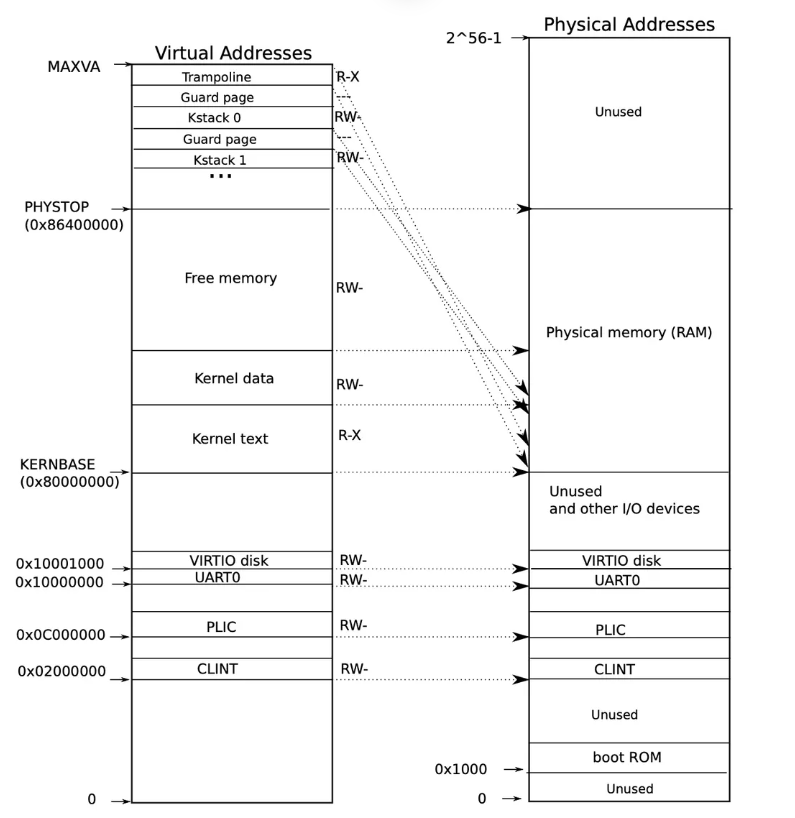
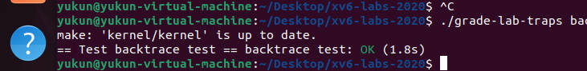
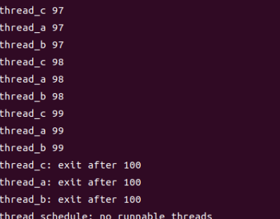
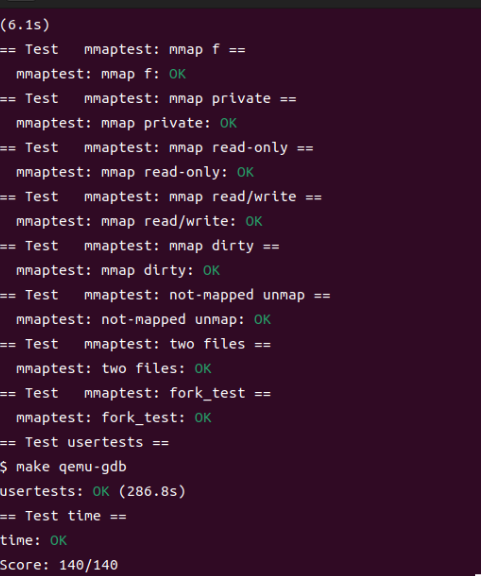

[环境准备](#环境准备)
# Lab-1
[lab-1-utilities](#lab-1-utilities-实验报告)
[lab-1-sleep](#lab-1-sleep-实验报告)
[lab-1-pingpong](#lab-1-pingpong-实验报告)
[lab-1-primes](#lab-1-primes-实验报告)
[lab-1-xargs](#lab-1-xargs-实验报告)
[lab-1-submission](#lab-1-submission)
# Lab-2
[lab-2-system-call-tracing](#lab-2-system-call-tracing-实验报告)
[lab-2-system-call-Sysinfo](#lab-2-system-call-sysinfo-实验报告)
[lab-2-submission](#lab-2-submission)
# Lab-3
[lab-3-print-a-page-table](#lab-3-print-a-page-table-实验报告)
[lab-3-a-kernel-page-table-per-process](#lab-3-a-kernel-page-table-per-process-实验报告)
[lab-3-simplify](#lab-3-simplify-实验报告)
[lab-3-submission](#lab-3-submission)
# Lab-4
[lab-4-backtrace-实验报告](#lab-4-risc-v-assembly-实验报告)
[lab-4-backtrace-实验报告](#lab-4-backtrace-实验报告)
[lab-4-alarm-test1test2-实验报告](#lab-4-alarm-test1test2-实验报告)
[lab-4-submission](#lab-4-submission)
# Lab-5
[lab-5-eliminate-allocation-from-sbrk-实验报告](#lab-5-eliminate-allocation-from-sbrk-实验报告)
[lab-5-lazy-allocation-实验报告](#lab-5-lazy-allocation-实验报告)
[lab-5-lazytests-and-usertests-实验报告](#lab-5-lazytests-and-usertests-实验报告)
[lab-5-submission](#lab-5-submission)
# Lab-6
[lab-6-copy-on-write-cow-fork-实验报告](#lab-6-copy-on-write-cow-fork-实验报告)
[lab-6-submission](#lab-6-submission)
# Lab-7
[lab-7-barrier-实验报告](#lab-7-barrier-实验报告)
[lab-7-using-threads-实验报告](#lab-7-using-threads-实验报告)
[lab-7-uthread-switching-between-threads-实验报告](#lab-7-uthread-switching-between-threads-实验报告)
[lab-7-submission](#lab-7-submission)
# Lab-8
[lab-8-buffer-cache-实验报告](#lab-8-buffer-cache-实验报告)
[lab-8-memory-allocator-实验报告](#lab-8-memory-allocator-实验报告)
[lab-8-submission](#lab-8-submission)
# Lab-9
[lab-9-large-files-实验报告](#lab-9-large-files-实验报告)
[lab-9-symbolic-links-实验报告](#lab-9-symbolic-links-实验报告)
[lab-9-submission](#lab-9-submission)
# Lab-10
[lab-10-mmap-实验报告](#lab-10-mmap-实验报告)
[lab-10-submission](#lab-10-submission)
# Lab-11
[lab-11-your-job-实验报告](#lab-11-your-job-实验报告)
[lab-11-submission](#lab-11-submission)


### 环境准备

1. **下载软件**：
   - **Ubuntu 22.04 LTS**: [Ubuntu官网](https://ubuntu.com/download/desktop)
   - **VMware Workstation Pro 17**: [VMware官网](https://www.vmware.com/products/workstation-pro.html)

### 安装VMware Workstation Pro 17

1. **安装步骤**：
   - 选择自定义安装。
   
   - 去掉用户体验设置的勾选。
    
   - 选择安装快捷方式。
     
   - 完成VM17的安装。
     

2. **创建虚拟机**：
   - 启动VMware，选择创建新的虚拟机。
   - 选择“自定义（高级）”安装。
      
   - 选择虚拟机兼容性为Workstation 12.x。
      
   - 选择稍后安装操作系统。
    
   - 选择操作系统为Linux，版本为Ubuntu。
   
   - 命名虚拟机为ubuntu22.04，并设置存储位置。
      
   - 设置处理器数量为2，每个处理器的核心数为1，总共2个处理器核心。
      
   - 根据电脑配置分配内存，推荐4G。
      
   - 网络类型选择NAT模式。
      
   - IO控制器类型和磁盘类型使用系统推荐设置。
   - 设置磁盘容量为80G，点击创建虚拟机。
    

3. **配置虚拟机**：
   - 在VMware中右键点击虚拟机，选择设置 -> 硬件 -> CD/DVD(SATA)。
   - 勾选“使用ISO映像文件”，选择下载好的Ubuntu 22.04.1 desktop ISO文件。
   - 点击确定。
    

4. **安装Ubuntu 22.04 LTS**：
   - 启动虚拟机，选择“Try or Install Ubuntu”，按Enter键。
   - 根据提示完成Ubuntu的安装，包括创建用户名和密码。

### 安装XV6实验环境

1. **下载XV6源码**：
   - 打开终端，输入以下命令下载XV6源码：
     ```bash
     git clone https://github.com/mit-pdos/xv6-public.git
     ```

2. **安装必要的工具**：
   - 更新包管理器并安装所需工具：
     ```bash
     sudo apt-get update
     sudo apt-get install build-essential qemu
     ```

3. **编译XV6**：
   - 进入XV6目录，编译源码：
     ```bash
     cd xv6-public
     make
     ```

4. **运行XV6**：
   - 编译完成后，运行XV6：
     ```bash
     make qemu
     ```
### Lab 1: Utilities 实验报告

#### 1. 实验目的
本次小实验的目的是使目录切换到 `xv6-labs-2020` 代码的 `util` 分支，并利用 QEMU 模拟器启动 xv6 系统。

#### 2. 实验步骤

**步骤 1**: 获取 xv6 实验源代码，并切换到 `util` 分支：

1. 使用 git 指令下载实验代码：
   ```bash
   git clone git://g.csail.mit.edu/xv6-labs-2020
   ```

2. 切换到 `util` 分支：
   ```bash
   cd xv6-labs-2020
   git checkout util
   ```

3. 查看 git 日志了解更改：
   ```bash
   git log
   ```

4. 提交修改：
   ```bash
   git commit -am 'my solution for util lab exercise 1'
   ```

**步骤 2**: 编译并运行 xv6 系统：

1. 编译并运行 xv6：
   ```bash
   make qemu
   ```

2. 当 xv6 通过 QEMU 模拟器启动后，启动 shell 进程，会看到如下输出，说明成功编译并运行 xv6 系统。
 

3. 输入 `ls` 命令，查看 xv6 目录下的文件：
   ```bash
   ls
   ```
    

4. 使用 `Ctrl+p` 查看当前的进程信息。
    

5. 通过输入 `Ctrl+a x` 退出 qemu。

#### 3. 实验中遇到的问题和解决方法
在进行XV6实验时，可能会遇到运行`make qemu`时卡住不动的问题。下面是详细的解决方法：
 

1. **问题描述**：
   - 在执行`make qemu`命令时，终端卡住不动，没有任何响应。

2. **解决方法**：
   - 通过安装QEMU 5.1.0版本来解决此问题。

##### 步骤如下：

1. **安装必要的依赖包**：
   - 打开终端，输入以下命令安装所需的依赖包：
     ```bash
     sudo apt-get install build-essential pkg-config libboost-all-dev autoconf libtool libssl-dev flex bison ninja-build libglib2.0-dev libpixman-1-dev libslirp-dev libncurses5-dev libncursesw5-dev
     ```

2. **下载并安装QEMU 5.1.0**：
   - 下载QEMU 5.1.0源代码：
     ```bash
     wget https://download.qemu.org/qemu-5.1.0.tar.xz
     ```
   - 解压下载的压缩包：
     ```bash
     tar xvJf qemu-5.1.0.tar.xz
     ```
   - 进入解压后的目录：
     ```bash
     cd qemu-5.1.0/
     ```
   - 配置QEMU：
     ```bash
     ./configure --disable-kvm --disable-werror --prefix=/usr/local --target-list="riscv64-softmmu"
     ```
   - 编译QEMU：
     ```bash
     make -j$(nproc)
     ```
   - 安装QEMU：
     ```bash
     sudo make install
     ```
   - 将QEMU的路径添加到环境变量：
     ```bash
     export PATH=$PATH:/usr/local/bin
     ```

3. **验证QEMU安装**：
   - 查看QEMU版本，确保安装成功：
     ```bash
     qemu-system-riscv64 --version
     ```

4. **返回XV6目录并运行**：
   - 返回XV6目录：
     ```bash
     cd ..
     ```
   - 再次运行`make qemu`，检查问题是否解决：
     ```bash
     make qemu
     ```

#### 4. 实验心得

通过本次实验进一步了解了类 Unix 操作系统的基本操作，之前并没有接触过 xv6 操作系统，本次实验使得我学习到了很多 Linux 指令，同时对 Ubuntu 桌面版也有了进一步的理解。通过解决版本兼容性问题，我也学会了如何手动下载、编译和安装特定版本的软件。这些知识对于将来处理类似问题有很大的帮助。

### Lab 1: Sleep 实验报告

#### 1. 实验目的

本次实验的目的是实现 UNIX 的 `sleep` 程序，即使当前进程暂停相应的时钟周期数，时钟周期数由用户指定。例如执行 `sleep 100`，则当前进程暂停，等待 100 个时钟周期后才继续执行。

#### 2. 实验步骤

**步骤 1**: 准备环境

1. 移除当前版本的 QEMU 系统：
   ```bash
   sudo apt-get remove qemu-system-misc
   ```
2. 安装旧版本的 QEMU 系统：
   ```bash
   sudo apt-get install qemu-system-misc=1:4.2-3ubuntu6
   ```
3. 下载 QEMU 5.1.0 源代码：
   ```bash
   wget https://download.qemu.org/qemu-5.1.0.tar.xz
   ```
4. 解压并安装 QEMU 5.1.0：
   ```bash
   tar xf qemu-5.1.0.tar.xz
   cd qemu-5.1.0
   ./configure --disable-kvm --disable-werror --prefix=/usr/local --target-list="riscv64-softmmu"
   make
   sudo make install
   ```

**步骤 2**: 编写 `sleep` 程序

1. 参照 `user` 目录下的其他程序，引入必要的头文件：
   ```c
   #include "kernel/types.h"
   #include "user/user.h"
   ```
2. 编写 `main` 函数：
   ```c
   int main(int argc, char *argv[]) {
       // 如果命令行参数不等于2个，则打印错误信息
       if (argc != 2) {
           // 使用 user/printf.c 中的 fprintf(int fd, const char *fmt, ...) 函数进行格式化输出
           fprintf(2, "Usage: sleep time\n");
           // 退出程序
           exit(1);
       }
       // 获取命令行给出的时钟周期
       int time = atoi(argv[1]);
       // 调用系统调用 sleep 函数
       sleep(time);
       // 正常退出程序
       exit(0);
   }
   ```
3. 在 `Makefile` 文件中添加配置，在 `UPROGS` 项中最后一行添加 `$U/_sleep\` 。


**步骤 3**: 运行和测试 `sleep` 程序

1. 编译并运行 xv6 系统：
   ```bash
   cd xv6-labs-2020
   git checkout util
   make qemu
   ```
2. 输入 `sleep` 命令进行测试：
   ```bash
   sleep 
   ```

**实验结果示例**：


3. 输入 `Ctrl+p` 查看当前的进程信息。


4. 通过输入 `Ctrl+a x` 退出 qemu。

5. 退出 xv6 后，运行单元测试：
   ```bash
   ./grade-lab-util sleep
   ```


#### 3. 实验中遇到的问题和解决方法

**问题描述**：
第一次输入 `./grade-lab-util sleep` 进行实验测评时，系统找不到 python 可执行文件.

**解决方法**：
在一些系统中，Python 3 可执行文件可能命名为 `python3`，而不是 `python`。可以通过创建一个符号链接来解决这个问题。
**创建符号链接**
确认 Python 版本：
首先，确认系统中安装的 Python 版本。运行以下命令查看安装的 Python 版本：

```bash
python3 --version
```
创建符号链接：
如果系统中安装了 Python 3，可以创建一个符号链接将 python 指向 python3：

```bash
sudo ln -s /usr/bin/python3 /usr/bin/python
```

再次运行评分脚本
执行完上述步骤后，尝试再次运行评分脚本：

```bash
./grade-lab-util sleep
```


#### 4. 实验心得

这是 Lab1 中最简单的一个任务。通过直接调用提供的 `sleep` 方法，我实现了 `sleep` 程序。这个实现过程让我进一步了解了 xv6 的指令执行步骤。相比之前直接进行指令调用，自己编写代码的方式让我更加了解指令的内部执行过程。在这个过程中，我也学习了如何处理命令行参数以及如何将字符串转换为整数，这些都是编写系统程序的基本技能。通过本次实验，我不仅掌握了如何编写一个简单的 `sleep` 程序，还学会了如何解决环境兼容性问题。总的来说，这次实验对于理解 xv6 的基本操作和系统调用机制有很大的帮助。

### Lab 1: Pingpong 实验报告

#### 1. 实验目的
本次实验的目的是编写一个程序，通过使用 UNIX 系统调用在两个进程之间通过一对管道进行 "ping-pong" 通信。具体要求如下：
- 父进程向子进程发送一个字节。
- 子进程打印 ": received ping"，并将管道上的字节写给父进程，然后退出。
- 父进程从子进程读取字节，打印 ": received pong"，然后退出。

#### 2. 实验步骤

**步骤 1: 创建 `pingpong.c` 文件并引入头文件**

在 `user` 目录下创建一个新的文件 `pingpong.c` 并引入必要的头文件。头文件包括 `kernel/types.h` 和 `user/user.h`。代码如下：
```bash
#include "kernel/types.h"
#include "user/user.h"

int main() {
    int p1[2]; // 父进程到子进程的管道
    int p2[2]; // 子进程到父进程的管道
    char buf[1]; // 缓冲区

    pipe(p1);
    pipe(p2);

    if (fork() == 0) { // 子进程
        // 关闭子进程不需要的管道端
        close(p1[1]);
        close(p2[0]);

        // 从父进程读取数据
        read(p1[0], buf, 1);
        printf("%d: received ping\n", getpid());

        // 向父进程写数据
        write(p2[1], buf, 1);

        // 关闭管道
        close(p1[0]);
        close(p2[1]);

        exit(0);
    } else { // 父进程
        // 关闭父进程不需要的管道端
        close(p1[0]);
        close(p2[1]);

        // 向子进程写数据
        write(p1[1], "X", 1);

        // 从子进程读取数据
        read(p2[0], buf, 1);
        printf("%d: received pong\n", getpid());

        // 关闭管道
        close(p1[1]);
        close(p2[0]);

        wait(0);
        exit(0);
    }
}
```


**步骤 3: 编译并运行 xv6 系统**

在 `xv6` 根目录下编译并运行系统：

```bash
make clean

make qemu
```

**步骤 4: 在 QEMU 中测试 `pingpong` 程序**

在 xv6 的 shell 提示符下，输入以下命令测试 `pingpong` 程序：

```bash
pingpong
```


**步骤 5: 运行单元测试**

退出 QEMU，并在当前目录下运行测试命令：

```bash
./grade-lab-util pingpong
```


#### 3. 实验中遇到的问题和解决办法

**问题 1: 管道通信**

由于本次实验涉及管道通信，一开始没有完全想清楚如何实现。通过复习操作系统课程中关于管道通信的知识，并查阅相关资料，成功编写了对应代码。关键在于正确处理管道读写端的关闭和进程间的同步。

#### 4. 实验心得

本次实验涉及管道通信，通过实验进一步理解了管道在进程间通信中的作用。管道提供了一种简单而有效的通信方式，在实际开发中也很常用。通过编写 `pingpong` 程序，了解了父子进程如何通过管道进行数据传输，以及如何使用 `fork` 和 `pipe` 系统调用创建和管理管道。总的来说，这次实验加深了对进程间通信的理解，也锻炼了编写和调试 xv6 程序的能力。在今后的学习和开发中，这些知识和技能都将是非常有用的。

### Lab 1: Primes 实验报告

#### 1. 实验目的
本次实验的目的是使用 `pipe` 和 `fork` 来建立管道，通过多个进程实现素数筛选。第一个进程将数字 2 到 35 送入管道，然后每个进程会读取管道数据，通过管道传递给下一个进程，只保留素数。

#### 2. 实验步骤

**步骤 1: 分析实验思路**

实验的基本思路是通过管道传递数据，并在每个进程中筛选出素数：
1. 第一个进程将数字 2 到 35 送入管道。
2. 每个进程读取管道数据，打印出第一个数字（素数），并过滤掉所有该素数的倍数。
3. 将剩余的数字传递给下一个进程。
4. 重复上述步骤，直到打印出所有的素数。


**步骤 2: 创建 `primes.c` 文件并引入头文件**

在 `user` 目录下创建一个新的文件 `primes.c`，并引入必要的头文件。头文件包括 `kernel/types.h` 和 `user/user.h`。代码如下：

```c
#include "kernel/types.h"
#include "user/user.h"

void sieve(int p[2]) {
    int prime;
    close(p[1]); // 关闭写端
    if (read(p[0], &prime, sizeof(prime)) == 0) {
        close(p[0]);
        return;
    }
    printf("prime %d\n", prime);

    int next_p[2];
    pipe(next_p);

    if (fork() == 0) {
        // 子进程继续处理
        close(next_p[1]); // 关闭写端
        sieve(next_p);
    } else {
        // 父进程继续过滤并传递剩余数字
        close(next_p[0]); // 关闭读端
        int num;
        while (read(p[0], &num, sizeof(num)) != 0) {
            if (num % prime != 0) {
                write(next_p[1], &num, sizeof(num));
            }
        }
        close(next_p[1]);
        wait(0);
    }
    close(p[0]);
}

int main() {
    int p[2];
    pipe(p);

    if (fork() == 0) {
        // 子进程开始筛选
        sieve(p);
    } else {
        // 父进程写入初始数据
        close(p[0]); // 关闭读端
        for (int i = 2; i <= 35; i++) {
            write(p[1], &i, sizeof(i));
        }
        close(p[1]); // 关闭写端
        wait(0);
    }
    exit(0);
}
```

**步骤 3: 修改 `Makefile` 文件**

在 `xv6` 根目录下找到 `Makefile` 文件，并在 `UPROGS` 项中追加一行 `$U/_primes\`。修改后的 `UPROGS` 部分如下：

```makefile
UPROGS = $(U)/_init \
         $(U)/_sh \
         $(U)/_cat \
         $(U)/_echo \
         $(U)/_grep \
         $(U)/_ls \
         $(U)/_mkdir \
         $(U)/_rm \
         $(U)/_pingpong \
         $(U)/_primes \
         $(U)/_sleep \
         $(U)/_wc
```

**步骤 4: 编译并运行 xv6 系统**

在 `xv6` 根目录下编译并运行系统：

```bash
make qemu
```

**步骤 5: 在 QEMU 中测试 `primes` 程序**

在 xv6 的 shell 提示符下，输入以下命令测试 `primes` 程序：

```bash
primes
```

会看到以下输出：

```
prime 2
prime 3
prime 5
prime 7
prime 11
prime 13
prime 17
prime 19
prime 23
prime 29
prime 31
```


**步骤 6: 运行单元测试**

退出 QEMU，并在当前目录下运行测试命令：

```bash
./grade-lab-util primes
```


#### 3. 实验中遇到的问题和解决办法

在编写 `primes.c` 程序时，处理管道通信和进程间数据传递的过程中，我遇到了 xv6 文件描述符数量的限制问题。xv6 中文件描述符的数量有限，这可能导致在复杂的管道操作中出现资源不足的问题。

为了应对这个问题，我参考了《xv6: a simple, Unix-like teaching operating system》中的 Pipes 部分，并决定使用文件描述符重定向技巧来解决这个问题。具体来说，我编写了一个映射函数 mapping，该函数通过关闭当前进程的某个文件描述符，然后使用 dup 函数将管道的读端或写端的描述符复制到刚刚关闭的文件描述符上，从而节约资源，避免了 xv6 文件描述符限制所带来的影响。

#### 4. 实验心得

本次实验涉及到了管道和进程间通信，通过实验进一步理解了管道在进程间通信中的作用。管道提供了一种简单而有效的通信方式，在实际开发中也很常用。通过编写 `primes` 程序，了解了如何通过管道传递数据，并在多个进程中筛选素数。本实验采用了埃拉托斯特尼素数筛的方法，通过每个进程过滤掉某个素数的倍数，最终筛选出所有的素数。这种方法直观且易于实现，也加深了对管道通信和进程间通信的理解。总的来说，这次实验加深了对进程间通信和管道的理解，也锻炼了编写和调试 xv6 程序的能力。在今后的学习和开发中，这些知识和技能都将是非常有用的。


### Lab 1: find 实验报告

#### 实验目的

本实验的目标是编写一个简单的 UNIX `find` 程序，用于在目录树中查找并输出包含特定名称的所有文件。解决方案应放在 `user/find.c` 中。

#### 实验步骤

1. **了解目录读取方式**：
   - 首先，阅读 `user/ls.c` 的源代码，以了解如何读取目录和文件信息。在该文件中，有两个关键函数需要关注：`fmtname()` 和 `ls()`。
   - `fmtname()` 函数用于格式化路径，提取出文件名，去掉路径前面的斜杠 `/`。
   - `ls()` 函数用于列出目录中的文件信息，包含打开路径、判断路径类型（文件或目录）、输出文件信息等步骤。

2. **编写 `find.c`**：
   - 在 `user/find.c` 中，编写 `find()` 函数，借鉴 `ls()` 函数的逻辑。
   - 声明必要的变量，包括文件名缓冲区、文件描述符、与文件相关的结构体等。
   - 使用 `open()` 函数打开给定路径，并通过系统调用获取文件或目录的模式，以判断其类型。
   - 如果路径是文件且名称与要查找的文件名匹配，则输出路径。
   - 如果路径是目录，则递归调用 `find()` 函数继续在子目录中查找。

3. **代码实现**：
```c
#include "kernel/types.h"
#include "kernel/stat.h"
#include "user/user.h"
#include "kernel/fs.h"

// This function formats the name of the file, stripping out the path and keeping only the filename
char* fmtname(char *path) {
    static char buf[DIRSIZ+1];
    char *p;

    // Find first character after last slash
    for(p=path + strlen(path); p >= path && *p != '/'; p--)
        ;
    p++;

    // Return blank-padded name
    if(strlen(p) >= DIRSIZ)
        return p;
    memmove(buf, p, strlen(p));
    buf[strlen(p)] = 0;
    return buf;
}

// This function recursively finds files with a specific name in the given path
void find(char *path, char *filename) {
    char buf[512], *p;
    int fd;
    struct dirent de;
    struct stat st;

    // Open the directory
    if((fd = open(path, 0)) < 0) {
        fprintf(2, "find: cannot open %s\n", path);
        return;
    }

    // Get the stats of the file/directory
    if(fstat(fd, &st) < 0) {
        fprintf(2, "find: cannot stat %s\n", path);
        close(fd);
        return;
    }

    switch(st.type) {
    case T_FILE:
        // If it's a file and the name matches, print the path
        if(strcmp(fmtname(path), filename) == 0) {
            printf("%s\n", path);
        }
        break;

    case T_DIR:
        // If it's a directory, read through it
        if(strlen(path) + 1 + DIRSIZ + 1 > sizeof buf) {
            printf("find: path too long\n");
            break;
        }
        strcpy(buf, path);
        p = buf + strlen(buf);
        *p++ = '/';
        while(read(fd, &de, sizeof(de)) == sizeof(de)) {
            if(de.inum == 0)
                continue;
            memmove(p, de.name, DIRSIZ);
            p[DIRSIZ] = 0;
            if(stat(buf, &st) < 0) {
                printf("find: cannot stat %s\n", buf);
                continue;
            }
            // Recursively call find if the directory isn't "." or ".."
            if(strcmp(de.name, ".") != 0 && strcmp(de.name, "..") != 0) {
                find(buf, filename);
            }
        }
        break;
    }
    close(fd);
}

int main(int argc, char *argv[]) {
    if(argc < 3) {
        fprintf(2, "Usage: find <path> <filename>\n");
        exit(1);
    }
    find(argv[1], argv[2]);
    exit(0);
}
```

4. **在 Makefile 中添加配置**：
   - 在 Makefile 文件中，UPROGS 项追加一行 `$U/_find\`，然后编译并运行 xv6 进行测试。

5. **测试结果**：
   - 运行 `find` 程序，确保其能够正确输出指定目录中与给定名称匹配的文件。
   - 退出 xv6，运行单元测试以检查结果是否正确。


#### 实验中遇到的问题和解决办法

在编写 `find` 函数时，需要知道如何读取目录和将路径格式化为文件名。通过参考 `user/ls.c` 文件，我利用其中的代码并修改参数，成功编写了 `find` 函数。尤其是在处理文件名时，需要注意在 `fmtname` 函数中设置 `buf[strlen(p)] = 0;`，以避免 `strcmp` 失效的问题。

#### 实验心得

- 本次实验涉及在路径中查找特定文件名的文件。我们基本上直接借鉴了 `user/ls.c` 的内容，但需要注意几个细节：
  - 在获取文件名的函数 (`fmtname`) 中，需要确保字符串以 `\0` 结束。
  - 使用 `memmove()` 函数进行安全的内存拷贝，因为它比 `memcpy()` 更安全。
  - 理解 `struct stat` 和 `struct dirent` 的作用，它们分别存储文件和目录的信息。

总而言之，通过本次实验，我学会了如何读取目录，并加深了对字符串函数（如 `strcpy` 和 `strcmp`）的理解。同时，了解了 `memmove` 和 `memcpy` 的区别，其中 `memmove` 是 `memcpy` 的改进版，更加安全，主要区别在于内存拷贝方向的处理。

### Lab 1: xargs 实验报告

#### 实验目的

编写一个简单的 UNIX `xargs` 程序，从标准输入中读取行，并为每一行运行一个命令，将该行作为命令的参数提供，并将解决方案放在 `user/xargs.c` 中。

#### 实验步骤

为了实现 `xargs`，我们需要：

1. **读取标准输入**：从标准输入中读取数据，将每一行作为参数传递给一个命令。
2. **创建子进程**：使用 `fork()` 创建子进程。
3. **执行命令**：调用 `exec()` 执行命令，将输入行附加为参数。
4. **处理参数**：定义一个字符数组，用于存放子进程的参数列表，大小为 `kernel/param.h` 中定义的 `MAXARG`。
5. **循环读取数据**：通过管道读取数据，根据空格符和换行符分割参数，逐行处理。

#### 实现代码

以下是 `xargs.c` 的完整实现代码：

```c
#include "kernel/types.h"
#include "kernel/stat.h"
#include "user/user.h"
#include "kernel/fcntl.h"

#define MAXN 512

int main(int argc, char *argv[]) {
    char buf[MAXN];
    char *argvs[MAXARG];
    int index = argc - 1; // Index to append new arguments

    if(argc < 2) {
        fprintf(2, "Usage: xargs command [initial-args]\n");
        exit(1);
    }

    // Copy initial arguments into argvs
    for(int i = 1; i < argc; i++) {
        argvs[i - 1] = argv[i];
    }

    // Read from stdin in a loop
    while(read(0, buf, sizeof(buf)) > 0) {
        int tempIndex = 0;
        char temp[MAXN] = {"\0"};

        // Process each character in the buffer
        for(int i = 0; i < strlen(buf); ++i) {
            if(buf[i] == '\n') {
                if (tempIndex > 0) {  // If we have a non-empty argument
                    temp[tempIndex] = '\0';  // Null-terminate the string
                    argvs[index] = temp;  // Add the temp argument to argvs

                    // Execute command when a new line is encountered
                    if(fork() == 0) {
                        exec(argv[1], argvs);  // Execute command with arguments
                        exit(0);  // Exit child if exec fails
                    }
                    wait(0);  // Wait for the child process to finish

                    // Reset for the next argument
                    tempIndex = 0;
                    temp[0] = '\0';
                }
            } else {
                temp[tempIndex++] = buf[i];  // Add character to temp
            }
        }
    }

    exit(0);
}
```
#### 实验结果显示


#### 实验中遇到的问题和解决办法

- **多行输入**：开始时，我没有处理多行输入的情况。通过确保每个新行都启动一个新的子进程来解决。
- **参数拼接**：确保正确拼接输入行到命令参数中，并处理空格和换行符。
- **子进程管理**：使用 `fork()` 创建子进程后，必须使用 `wait(0)` 确保子进程执行完毕后才继续。

#### 实验心得

- **学习点**：通过这个实验，我学习了如何在 UNIX 环境下使用 `xargs` 命令，将标准输入转换为命令参数。这加深了我对管道、进程管理和命令执行的理解。
- **重要性**：`xargs` 是一个非常有用的命令，可以将输入作为参数传递给其他命令执行，灵活地处理输入输出流。

### Lab 1: Submission
退出 xv6 ，运行整个 Lab 1 测试，检查结果是否正确


#### 实验中遇到的问题和解决办法

一开始没有创建`time.txt`文件 导致系统`cannot read time.txt` 无法 `test time` 在`xv6`目录下创建该文件即可

### Lab 2: System call tracing 实验报告

#### 实验目的

本实验的目的是在 xv6 操作系统中实现一个系统调用跟踪功能。具体来说，我们需要创建一个新的 `trace` 系统调用来控制跟踪功能。该系统调用接受一个整数“掩码”（mask）作为参数，用于指定要跟踪的系统调用。例如，要跟踪 `fork` 系统调用，程序会调用 `trace(1 << SYS_fork)`，其中 `SYS_fork` 是 `kernel/syscall.h` 中定义的系统调用编号。

#### 实验步骤

1. **分析需求：**  
   分析实验要求，我们需要实现一个能够追踪系统调用的函数。查看 `user/trace.c` 的代码可以发现，程序首先调用 `trace(int)`，然后将命令行中的参数 `argv` 复制到 `nargv` 中，同时删除前两个参数。

2. **添加系统调用号：**  
   - 在 `kernel/syscall.h` 中为新的系统调用添加系统调用号。
   
   - 在 `user/usys.pl` 中新增一个入口。
    
   - 在 `user/user.h` 中新增 `trace` 函数的声明。
     

3. **格式化输出：**  
   实现功能：当 `trace` 被调用时，内核会输出被追踪的系统调用的相关信息，格式为：
   ```
   <pid>: syscall <syscall_name> -> <return_value>
   ```
   为实现此功能，需要在 `/kernel/proc.h` 文件的 `proc` 结构体中添加一个新的变量，使每个进程都拥有自己独立的 `mask` 变量。
     


4. **实现 `trace` 函数：**  
   在 `kernel/sysproc.c` 中实现 `trace` 函数的具体功能。
     

5. **注册系统调用：**  
   - 在 `kernel/syscall.h` 中新增 `sys_trace` 函数的定义。
   - 在 `kernel/syscall.c` 的函数指针数组中新增 `sys_trace`，并创建一个数组来存放系统调用的名称。通过 `mask` 值来决定是否打印系统调用的信息。

6. **子进程继承父进程的 `mask`：**  
   在 `kernel/proc.c` 中的 `fork` 函数中，确保子进程能够继承父进程的 `mask`。

7. **测试：**  
   使用 `./grade-lab-syscall trace` 指令测试程序的正确性。
      

#### 实验中遇到的问题和解决方法

在实验过程中，我忘记在 `kernel/proc.c` 的 `fork` 函数中加入 `np->mask = p->mask;` 这一行，导致测试 `trace children` 不通过。这个问题在提示中已经提到：子进程需要复制父进程的 `mask`。

实验中需要注意以下几点：
- `mask` 是按位进行判断的。
- `proc` 结构体中的 `name` 是整个线程的名字，而不是函数调用的函数名称。因此，不能直接使用 `p->name`，而是需要自己定义一个数组来存放系统调用的名称。

#### 实验心得

在进行本次实验前，我阅读了书本上关于用户调用如何在内核中实现的内容。实验中我们通过修改 `syscalls` 数组以及使用 `fork` 和 `exec` 来实现对系统调用的跟踪。通过这次实验，我对 xv6 操作系统中系统调用的工作机制有了更深入的理解，包括如何通过内核实现用户空间的功能。

本次实验让我更好地理解了 RISC-V 架构下的系统调用机制，也熟悉了 xv6 内核中关于进程管理和系统调用实现的细节。这对我深入学习操作系统原理提供了很大帮助。


### Lab 2: System call Sysinfo 实验报告

#### 实验目的

在本次实验中，我们的目标是为 xv6 操作系统实现一个新的系统调用 `sysinfo`。该系统调用将返回有关系统状态的信息，包括可用内存和非 `UNUSED` 状态的进程数量。我们将通过一个测试程序 `sysinfotest` 验证实现的正确性。

#### 实验步骤

1. **定义系统调用号**
   - 在 `kernel/syscall.h` 中为新的 `sysinfo` 系统调用定义一个系统调用号。

     ```c
     #define SYS_sysinfo 23
     ```

2. **添加用户空间支持**
   - 在 `user/usys.pl` 中添加一个新的系统调用入口。

     ```perl
     entry("sysinfo");
     ```

   - 在 `user/user.h` 中声明 `sysinfo` 结构体和 `sysinfo` 函数。

     ```c
     struct sysinfo {
         uint64 freemem;  // 可用内存字节数
         uint64 nproc;    // 非 UNUSED 状态的进程数
     };

     int sysinfo(struct sysinfo *info);
     ```

3. **实现系统调用**
   - 在 `kernel/syscall.c` 中定义 `sys_sysinfo` 函数。

     ```c
     extern uint64 sys_sysinfo(void);
     ```

   - 在 `kernel/syscall.c` 中的系统调用表中注册 `sys_sysinfo`。

     ```c
     static uint64 (*syscalls[])(void) = {
         [SYS_fork]    sys_fork,
         [SYS_exit]    sys_exit,
         [SYS_wait]    sys_wait,
         [SYS_pipe]    sys_pipe,
         [SYS_read]    sys_read,
         [SYS_kill]    sys_kill,
         [SYS_exec]    sys_exec,
         [SYS_fstat]   sys_fstat,
         [SYS_chdir]   sys_chdir,
         [SYS_dup]     sys_dup,
         [SYS_getpid]  sys_getpid,
         [SYS_sbrk]    sys_sbrk,
         [SYS_sleep]   sys_sleep,
         [SYS_uptime]  sys_uptime,
         [SYS_open]    sys_open,
         [SYS_write]   sys_write,
         [SYS_mknod]   sys_mknod,
         [SYS_unlink]  sys_unlink,
         [SYS_link]    sys_link,
         [SYS_mkdir]   sys_mkdir,
         [SYS_close]   sys_close,
         [SYS_sysinfo] sys_sysinfo,
     };
     ```

   - 在 `syscall_names` 数组中添加 `"sysinfo"`。

     ```c
     static char *syscall_names[] = {
         "fork",
         "exit",
         "wait",
         "pipe",
         "read",
         "kill",
         "exec",
         "fstat",
         "chdir",
         "dup",
         "getpid",
         "sbrk",
         "sleep",
         "uptime",
         "open",
         "write",
         "mknod",
         "unlink",
         "link",
         "mkdir",
         "close",
         "sysinfo",
     };
     ```

4. **修改 `proc` 结构体**
   - 在 `kernel/proc.h` 中更新 `mask` 数组的长度以适应新系统调用。

     ```c
     #define NUM_SYSCALLS 24
     ```

5. **获取系统信息**

   - 在 `kernel/kalloc.c` 中实现 `freemem_size` 函数以获取可用内存。

     ```c
     uint64 freemem_size(void) {
         struct run *r;
         uint64 free_mem = 0;

         acquire(&kmem.lock);
         r = kmem.freelist;
         while (r) {
             free_mem += PGSIZE;
             r = r->next;
         }
         release(&kmem.lock);

         return free_mem;
     }
     ```

   - 在 `kernel/proc.c` 中实现 `proc_num` 函数以获取活动进程数。

     ```c
     int proc_num(void) {
         struct proc *p;
         int n = 0;

         for (p = proc; p < &proc[NPROC]; p++) {
             if (p->state != UNUSED)
                 n++;
         }
         return n;
     }
     ```

6. **声明函数**
   - 在 `kernel/defs.h` 中声明新函数。

     ```c
     uint64 freemem_size(void);
     int proc_num(void);
     ```

7. **实现 `sysinfo` 系统调用**
   - 在 `kernel/sysproc.c` 中实现 `sysinfo` 函数。

     ```c
     #include "sysinfo.h"

     uint64
     sys_sysinfo(void)
     {
         struct sysinfo info;
         uint64 addr;

         if (argaddr(0, &addr) < 0)
             return -1;

         info.freemem = freemem_size();
         info.nproc = proc_num();

         if (copyout(myproc()->pagetable, addr, (char *)&info, sizeof(info)) < 0)
             return -1;

         return 0;
     }
     ```

8. **测试和验证**
   - 在 `Makefile` 中配置 UPROGS 项目，添加 `$U/_sysinfo\`。

   - 通过 `make qemu` 启动 QEMU 平台，输入 `sysinfotest` 指令进行测试。预期结果应输出 `"sysinfotest: OK"`。
      
#### 实验中遇到的问题和解决办法

1. **系统调用定义遗漏**：
   - 在初次运行 `sysinfotest` 时，由于未在 `kernel/syscall.c` 中添加 `sys_sysinfo` 的函数定义，导致测试失败。通过添加定义解决了此问题。

2. **缺少 Makefile 配置**：
   - 忘记在 `Makefile` 中的 UPROGS 项中添加配置，导致 `sysinfo` 无法运行。通过在 UPROGS 中添加 `$U/_sysinfo\` 解决了问题。

#### 实验心得

本次实验让我深入了解了 xv6 系统调用的实现过程。通过阅读相关文档和参考资料，我学习到了如何在 xv6 中添加新的系统调用，特别是在内核和用户空间之间传递数据的细节。实现 `sysinfo` 系统调用需要处理多个模块和文件的修改，从而实现系统信息的获取与展示。这项任务锻炼了我在操作系统级别进行开发的能力。此外，通过对 xv6 内存管理机制和进程管理机制的分析，加深了我对操作系统核心概念的理解。在实验过程中，使用链表来计算空闲内存页，遍历 `proc` 数组来统计活动进程数，这些操作帮助我更好地掌握了 xv6 的内核结构。

### Lab 2: Submission
退出 xv6 ，运行整个 Lab 2 测试，检查结果是否正确


### lab 3: Print a page table 实验报告

#### 实验目的

本次实验的目的是更好地理解RISC-V页表，并通过编写一个打印页表内容的函数来辅助将来的调试工作。我们需要在xv6操作系统中定义一个`vmprint()`函数，该函数接受一个`pagetable_t`作为参数，并以特定格式打印出页表内容。

#### 实验步骤

##### 1. 函数定义

我们需要定义一个名为`vmprint()`的内核函数，用于打印传入的页表。这将有助于调试本实验及后续实验。

##### 2. 理解RISC-V地址转换

RISC-V使用三级页表结构进行逻辑地址转换：
- **9位**用于第一级索引以找到第二级页表。
- **9位**用于第二级索引以找到第三级页表。
- **9位**用于第三级索引以找到内存页。
- 最低的**12位**用于页内偏移（每页4096字节）。

##### 3. 实现`vmprint()`

`vmprint()`函数需要递归遍历三级页表结构，并按以下格式打印：

```
page table 0x0000000087f6e000
..0: pte 0x0000000021fda801 pa 0x0000000087f6a000
.. ..0: pte 0x0000000021fda401 pa 0x0000000087f69000
.. .. ..0: pte 0x0000000021fdac1f pa 0x0000000087f6b000
.. .. ..1: pte 0x0000000021fda00f pa 0x0000000087f68000
.. .. ..2: pte 0x0000000021fd9c1f pa 0x0000000087f67000
..255: pte 0x0000000021fdb401 pa 0x0000000087f6d000
.. ..511: pte 0x0000000021fdb001 pa 0x0000000087f6c000
.. .. ..510: pte 0x0000000021fdd807 pa 0x0000000087f76000
.. .. ..511: pte 0x0000000020001c0b pa 0x0000000080007000
```

##### 4. 代码实现

我们可以修改已有的`freewalk()`函数（该函数递归释放页表），将其代码中的释放部分替换为打印部分。

```c
int vmprint(pagetable_t pagetable); // 函数声明

void vmprint(pagetable_t pagetable, int level) {
    if (pagetable == 0)
        return;

    for (int i = 0; i < 512; i++) {
        pte_t pte = pagetable[i];
        if (pte & PTE_V) {
            uint64 pa = PTE2PA(pte);
            for (int j = 0; j < level; j++) {
                printf("..");
            }
            printf("%d: pte 0x%016lx pa 0x%016lx\n", i, pte, pa);
            if ((pte & (PTE_R | PTE_W | PTE_X)) == 0) { // 如果是页表而非数据页
                vmprint((pagetable_t)pa, level + 1);
            }
        }
    }
}
```

##### 5. 集成与测试

在`exec.c`的返回语句前，为第一个进程插入`vmprint()`的调用：

```c
if (p->pid == 1) {
    vmprint(p->pagetable, 0);
}
```

##### 6. 测试实现

在实现函数后，使用`make grade`中的`pte printout`测试页表打印功能。

也可以运行`make qemu`查看打印的页表信息。

#### 遇到的问题及解决方案

##### 问题：Python环境

在用`./grade-lab-pgtbl pte`评分时，出现`usr/bin/env`无法找到`python`的错误。这是因为Ubuntu安装的是Python 3，解决办法是修改`grade-lab-pgtbl`文件，将`python`改为`python3`。

#### 实验心得

通过分析页表结构，我了解到“..0”表示一级页表中的第一个页表项（Page Table Entry, PTE）。整个页表结构为：

- **page table**: 表示二级页表整体。
- **..0**: 表示一级页表的第一个PTE。
- **.. ..0**: 表示二级页表的第一个PTE所指向的三级页表项（即页框）。

此结构展示了多级页表机制的工作方式，通过上层页表找到下层页表，最终指向实际的物理页框。

### Lab 3: A Kernel Page Table per Process 实验报告

#### 1. 实验目的

Xv6有一个单独的用于在内核中执行程序时的内核页表。内核页表直接映射到物理地址，也就是说内核虚拟地址 x 映射到物理地址仍然是 x。Xv6还为每个进程的用户地址空间提供了一个单独的页表，只包含该进程用户内存的映射，从虚拟地址0开始。因为内核页表不包含这些映射，所以用户地址在内核中无效。因此，当内核需要使用在系统调用中传递的用户指针（例如，传递给 `write()` 的缓冲区指针）时，内核必须首先将指针转换为物理地址。本节和下一节的目标是允许内核直接解引用用户指针。

我们的第一项工作是修改内核来让每一个进程在内核中执行时使用它自己的内核页表的副本。修改 `struct proc` 来为每一个进程维护一个内核页表，修改调度程序使得切换进程时也切换内核页表。对于这个步骤，每个进程的内核页表都应当与现有的全局内核页表完全一致。总而言之，xv6 原本的设计是，用户进程在用户态使用各自的用户态页表，但是一旦进入内核态（例如使用了系统调用），则切换到内核页表（通过修改 `satp` 寄存器，`trampoline.S`）。然而这个内核页表是全局共享的，也就是全部进程进入内核态都共用同一个内核态页表，本次实验的目标是让每一个进程进入内核态后，都能有自己的独立内核页表，为第三个实验做准备。

#### 2. 实验步骤

1. **修改 `struct proc`：** 首先给 `kernel/proc.h` 里面的 `struct proc` 加上内核页表的字段。
   
2. **初始化内核页表：** 在 `vm.c` 中添加新的方法 `proc_kpt_init`，该方法用于在 `allocproc` 中初始化进程的内核页表。这个函数还需要一个辅助函数 `uvmmap`，该函数和 `kvmmap` 方法几乎一致，不同的是 `kvmmap` 是对 Xv6 的内核页表进行映射，而 `uvmmap` 将用于进程的内核页表进行映射。然后在 `kernel/proc.c` 里面的 `allocproc` 调用。

3. **迁移代码到 `allocproc`：** 为了确保每一个进程的内核页表都关于该进程的内核栈有一个映射。我们需要将 `procinit` 方法中相关的代码迁移到 `allocproc` 方法中。很明显就是下面这段代码，将其剪切到上述内核页表初始化的代码后。

4. **修改 `scheduler()`：** 修改 `scheduler()` 来加载进程的内核页表到 SATP 寄存器。提示里面请求阅读 `kvminithart()`。`kvminithart` 是用于原先的内核页表，我们将进程的内核页表传进去就可以。在 `vm.c` 里面添加一个新方法 `proc_inithart`。然后在 `scheduler()` 内调用即可，但在结束的时候，需要切换回原先的 `kernel_pagetable`。直接调用上面的 `kvminithart()` 就能把 Xv6 的内核页表加载回去。

5. **释放内核页表：** 在 `freeproc` 中释放一个进程的内核页表。首先释放页表内的内核栈，调用 `uvmunmap` 可以解除映射，最后的一个参数（`do_free`）为一的时候，会释放实际内存。然后释放进程的内核页表，先在 `kernel/proc.c` 里面添加一个方法 `proc_freekernelpt`。如下，历遍整个内核页表，然后将所有有效的页表项清空为零。如果这个页表项不在最后一层的页表上，需要继续进行递归。

6. **添加函数定义：** 将需要的函数定义添加到 `kernel/defs.h` 中。

7. **修改 `kvmpa`：** 修改 `vm.c` 中的 `kvmpa`，将原先的 `kernel_pagetable` 改成 `myproc()->kernelpt`，使用进程的内核页表。

   ```c
   #include "spinlock.h"
   #include "proc.h"
   uint64 kvmpa(uint64 va) {
       uint64 off = va % PGSIZE;
       pte_t *pte;
       uint64 pa;
       pte = walk(myproc()->kernelpt, va, 0);
       if(pte == 0)
           panic("kvmpa");
       if((*pte & PTE_V) == 0)
           panic("kvmpa");
       pa = PTE2PA(*pte);
       return pa + off;
   }
   ```

8. **测试代码：** 测试一下我们的代码。

#### 3. 实验中遇到的问题和解决办法

本次实验比较复杂，需要改动的代码部分很多，我做的时间也比较久，因为本次实验的目的是为每个进程进入内核态后，都能有自己的独立内核页表，所以我们需要着重修改 `kvminit`。内核需要依赖内核页表内一些固定的映射的存在才能正常工作，例如 UART 控制、硬盘界面、中断控制等。而 `kvminit` 原本只为全局内核页表 `kernel_pagetable` 添加这些映射。我们需要抽象出来一个可以为任何我们自己创建的内核页表添加这些映射的函数，在一开始我并没有搞清楚具体要怎么写这个函数，所以参照了 [mit6.s081] 笔记 Lab3: Page tables | 页表 - 掘金 (juejin.cn) 的一篇教程，仔细研读比较和我自己之前写的代码后就发现了自己的问题。

#### 4. 实验心得

在做本次实验之前，我们需要熟悉书上的图3.3，了解内核地址空间与物理地址的映射关系如下：我们需要在知道内核虚拟地址和物理地址的映射关系之后，才能思考如何为每个进程都分配一张独立的内核页表。然后就是本次实验的难度系数比较大，要改动的地方很多，一些地方我自己并没有完全搞明白，所以参照了网上的一些教程，总之这次实验最本质的目的就是 xv6 为了实现现代操作系统三大特性之隔离性（进程之间互不干预），于是为每个进程都分配独立的内核页表，改变所有进程都共享同一内核页表的局面，进而能够避免多进程之间因共享内核代码和内核数据而引发的系统错误。



### Lab 3: Simplify 实验报告

#### 1. 实验目的

在进程的内核态页表中维护一个用户态页表映射的副本，这样使得内核态也可以对用户态传进来的指针（逻辑地址）进行解引用。这种方法相比原来的 `copyin` 的实现具有以下优势：

- **效率更高**：通过在内核页表中维护映射副本，可以利用 CPU 的硬件寻址功能进行寻址。
- **快表加速**：提高了内存访问的效率。
- **简化访问**：不再需要软件模拟访问页表的过程来获取物理地址。

#### 2. 实验步骤

1. **添加复制函数**：在实现过程中，需要注意在内核模式下无法访问设置了 `PTE_U` 的页面，因此需要将其移除。

2. **复制用户映射到内核页表**：在内核中修改每一处进程的用户映射（`fork()`、`exec()` 和 `sbrk()`），将其复制到进程的内核页表。

3. **限制用户内存增长**：在 `kernel/sysproc.c` 中找到 `sys_sbrk(void)`，可以看到 `growproc` 负责将用户内存增加或缩小 `n` 个字节。为了防止用户进程增长到超过 PLIC 的地址，需要给它加个限制。

4. **替换原有函数**：将原有的 `copyin()` 和 `copyinstr()` 替换掉。

5. **更新函数定义**：将新的函数定义添加到 `kernel/defs.h` 中。

6. **测试代码**：最后输入 `usertests` 查看输出结果。


#### 3. 实验中遇到的问题和解决办法
在使用 `usertests` 程序进行测试时，可能会出现测试结果不稳定的情况，有时能全部通过，有时出现 `panic`。为了解决这个问题，可以在 `switch` 之后再切换回内核页表。由于调度器使用的是内核栈，而其他进程陷入时使用的是进程内核栈，导致内核页表和进程内核页表映射不完全一致。


#### 4. 实验心得

通过这次实验，我明白了 xv6 为了方便让已进入内核的进程获取用户态的地址空间，设计了一种将用户态页表塞到内核页表中的机制。如此一来，当已进入内核的进程想要查询进程用户态的某一地址空间时，无需再切回用户态，直接在内核中就能实现查询和地址翻译工作。这大大节省了用户态和内核态之间来回切换的代价，是一个典型的空间换时间的案例。

### Lab 3: Submission
退出 xv6 ，运行整个 Lab 3 测试，检查结果是否正确


### lab 4: RISC-V Assembly 实验报告

#### 1. 实验目的

理解 RISC-V 汇编语言的基本操作和其在 xv6 操作系统中的应用。通过阅读和分析 `user/call.asm` 中的汇编代码，解答以下问题：

1. 了解哪些寄存器用于保存函数参数。
2. 理解 `main` 中对 `f` 和 `g` 函数调用的位置。
3. 确定 `printf` 函数所在的内存地址。
4. 分析 `jalr` 指令后的 `ra` 寄存器值。
5. 理解输出结果与 RISC-V 小端存储方式之间的关系。
6. 探讨输出中 `y` 的不确定性及其原因。

#### 2. 实验步骤

1. **生成汇编文件**：
   - 执行 `make fs.img` 编译 `user/call.c`，并生成 `user/call.asm` 文件。

2. **分析汇编文件**：
   - 阅读 `call.asm` 中函数 `g`、`f` 和 `main` 的代码。

3. **回答问题**：
   - 根据汇编代码回答实验中的问题，并将答案存储在 `answers-traps.txt` 文件中。

##### 问题解答：

1. **寄存器保存函数参数**：
   - RISC-V 中，前 8 个函数参数存放在 `a0-a7` 寄存器中。在 `main` 对 `printf` 的调用中，参数 `13` 存放在 `a2` 寄存器中。

2. **函数调用位置**：
   - 在 C 代码中，`main` 调用 `f`，`f` 调用 `g`。在生成的汇编中，`main` 函数进行了内联优化处理，直接得到结果，没有实际的函数调用。

3. **`printf` 函数地址**：
   - 在汇编文件中，`printf` 的地址为 `0x630`。在完成 `alarm` 后，汇编文件会发生变化，`printf` 的地址也可能变化。

4. **`ra` 寄存器值**：
   - `ra` 寄存器保存函数调用的返回地址，即 `jalr` 指令后的下一条指令地址，为 `0x38`。

5. **程序输出分析**：
   - 输出为 `"HE110 World"`。由于 RISC-V 是小端存储，低字节在低地址。如果为大端存储，`i` 应设置为 `0x726c6400`，`57616` 不需要更改。

6. **`y` 的不确定性**：
   - 输出结果为 `x=3`，但 `y` 是不确定的值，可能是 `a2` 寄存器的值。因为原本需要两个参数，却只传入了一个，导致 `y` 的值取决于 `a2` 中之前保存的数据。

#### 3. 实验中遇到的问题和解决办法

在回答第四个问题时，深入理解了 `auipc` 和 `jalr` 指令：

- **`auipc` (Add Upper Immediate to PC)**：
  - 指令格式：`auipc rd, imm`，将 20 位立即数左移 12 位后加上 PC 的值，将结果保存到 `rd` 寄存器。
  
- **`jalr` (Jump and Link Register)**：
  - 指令格式：`jalr rd, offset(rs1)`，将当前 PC+4 保存在 `rd` 中，然后跳转到指定偏移地址 `offset(rs1)`。
  
在 xv6 代码中：
```bash
30: 00000097 auipc ra,0x0
34: 600080e7 jalr 1536(ra) # 630 <printf>
```
- `auipc ra,0x0` 将 PC 的值保存到 `ra` 中。
- `jalr 1608(ra)` 执行后，跳转到 `printf` 的地址，并将 `PC+4` 保存到 `ra` 中，用于函数返回。

#### 4. 实验心得

通过本次实验，我加强了对 RISC-V 汇编的理解，进一步了解了底层代码的实现逻辑。RISC-V 汇编语言是针对 RISC-V 架构的汇编语言，具有以下主要特征：

1. 指令集小巧，语法简单。
2. 指令固定长度为 32 位格式。
3. 只有少量基础指令集，其他指令以扩展模块方式添加。
4. 指令采用类似 C 语言的寄存器命名风格。
5. 支持通用寄存器、控制状态寄存器和向量寄存器。
6. 变量和数据标签使用 `.data` 和 `.text` 段。


### lab 4: Backtrace 实验报告

#### 1. 实验目的

回溯（Backtrace）对于调试非常有用：它提供了一个函数调用列表，用于指示错误发生的位置。通过在栈帧中保存调用者帧指针的地址，编译器能够遍历栈帧并打印每个栈帧中保存的返回地址。此实验旨在实现一个基于 RISC-V 架构的 backtrace 功能。

#### 2. 实验步骤

1. **在 `kernel/defs.h` 添加定义**：
   - 为 `backtrace` 函数添加函数声明，使其在其他文件中可用。

2. **实现 `r_fp()` 函数**：
   - 修改 `kernel/riscv.h`，添加 `r_fp()` 函数，用于读取寄存器 `s0`（帧指针）的值。
   ```c
   static inline uint64 r_fp() {
       uint64 x;
       asm volatile("mv %0, s0" : "=r" (x) );
       return x;
   }
   ```

3. **在 `kernel/printf.c` 中实现 `backtrace()`**：
   - 实现 `backtrace()` 函数，利用帧指针遍历栈帧并打印每个帧中保存的返回地址。
   ```c
   void backtrace(void) {
       uint64 fp = r_fp();
       printf("Backtrace:\n");
       while(fp) {
           uint64 ra = *(uint64 *)(fp - 8);
           printf("  ra %p\n", ra);
           fp = *(uint64 *)(fp - 16); // move to previous frame
       }
   }
   ```

4. **在 `kernel/sysproc.c` 中调用 `backtrace()`**：
   - 在 `sys_sleep()` 函数中调用 `backtrace()`，以便在进行 sleep 操作时触发回溯。
   ```c
   void sys_sleep(void) {
       // existing sleep functionality
       backtrace(); // trigger backtrace
   }
   ```

5. **测试结果**：
   - 运行 `make qemu`，在 `sys_sleep()` 被调用时，验证 `backtrace()` 的输出，确保打印出完整的调用栈。
  
    
#### 3. 实验中遇到的问题和解决办法

在第一次完成所有实验步骤后，运行 `make qemu` 未能成功。经过仔细检查，发现问题是由于编译过程中未能更新所有依赖。通过执行 `make clean` 清理编译环境，然后重新运行 `make qemu`，问题得以解决。

#### 4. 实验心得

这个实验通过回溯调用栈，帮助我们理解函数调用栈的结构。在栈帧中，通常每个函数栈帧的头部包含返回地址和上一栈帧的指针。利用这一特性，我们可以实现对内核中所有调用栈的回溯。这种功能在编程和调试中非常常见，当编译器报错时，通常会打印类似的回溯信息，如程序文件名、函数名以及行号等信息。

通过本次实验，我加深了对 RISC-V 架构下栈帧布局的理解，也掌握了如何通过栈帧指针遍历和打印函数调用栈的技术，为日后的系统调试打下了基础。
  

### lab 4: Alarm-Test1/Test2 实验报告

#### 1. 实验目的

在处理定时器中断时，确保程序在警报处理程序完成后能够恢复正常执行是至关重要的。此实验旨在实现一个机制，使得在 `alarmtest` 程序中，定时器中断后能正确地返回到用户程序的执行流。在定时器中断发生时，需要确保所有寄存器和状态都能在中断后恢复，使得程序能够继续不受干扰地运行。此外，警报触发后，应能够重新设置警报计数器，以便周期性调用处理程序。

#### 2. 实验步骤

1. **修改 `kernel/proc.h`**：
   - 添加保存和恢复处理程序状态所需的数据结构。定义一个 `trapframeSave` 结构体，用于保存中断发生时的寄存器状态。
   ```c
   struct trapframeSave {
       uint64 epc;
       uint64 ra;
       uint64 sp;
       uint64 gp;
       uint64 tp;
       uint64 t0;
       uint64 t1;
       uint64 t2;
       uint64 s0;
       uint64 s1;
       uint64 a0;
       uint64 a1;
       uint64 a2;
       uint64 a3;
       uint64 a4;
       uint64 a5;
       uint64 a6;
       uint64 a7;
       uint64 s2;
       uint64 s3;
       uint64 s4;
       uint64 s5;
       uint64 s6;
       uint64 s7;
       uint64 s8;
       uint64 s9;
       uint64 s10;
       uint64 s11;
       uint64 t3;
       uint64 t4;
       uint64 t5;
       uint64 t6;
   };
   ```

2. **修改 `kernel/proc.c`**：
   - 修改 `allocproc()` 和 `freeproc()` 函数，以便在创建和释放进程时初始化和清理新的 `trapframeSave` 结构体。

3. **修改 `kernel/trap.c`**：
   - 添加 `switchTrapframe()` 函数，用于在中断处理期间切换和恢复 `trapframe` 的状态。
   ```c
   void switchTrapframe(struct proc *p) {
       if (p->inHandler) {
           memmove(p->trapframe, &p->tfbackup, sizeof(struct trapframe));
           p->inHandler = 0;
       } else {
           memmove(&p->tfbackup, p->trapframe, sizeof(struct trapframe));
           p->trapframe->epc = (uint64)p->handler;
           p->inHandler = 1;
       }
   }
   ```

4. **修改 `kernel/defs.h`**：
   - 为 `switchTrapframe` 和 `trapframeSave` 添加函数声明。

5. **修改 `kernel/sysproc.c` 中的 `sys_sigreturn()`**：
   - 实现 `sys_sigreturn()` 函数体，以便在警报处理完成后恢复原始的执行环境。
   ```c
   uint64
   sys_sigreturn(void)
   {
       struct proc *p = myproc();
       memmove(p->trapframe, &p->tfbackup, sizeof(struct trapframe));
       return 0;
   }
   ```

6. **测试和验证**：
   - 使用 `make qemu` 编译和运行 xv6，在 `alarmtest.c` 中调用 `periodic` 示例，验证程序是否能够正确恢复执行，并打印出预期的输出。
  
  
  

#### 3. 实验中遇到的问题和解决办法

在实验过程中，我遇到了 trapframe 和 trapframeSave 两个变量的使用混乱问题，导致程序无法正常运行。初始时未能正确区分这两个变量的用途，导致 `trapframe` 的错误引用。在 `kernel/proc.h` 中，将错误的 `trapframe` 修改为 `trapframeSave` 后，问题得以解决。

#### 4. 实验心得

在异常控制流的转移中，我们主要通过修改 `trapframe` 中的 `epc` 来实现。在 PCB 中维护一个时间间隔和计时器，当计时器时间到达时，通过 `userret` 将 `epc` 修改为处理程序的地址。回到用户态后，程序将跳转到处理程序。

为了从处理程序恢复到原执行流，我们需要保存处理程序调用前的寄存器和 `epc` 状态。由于直接使用 `trapframe` 不行，因为在往返内核态时都会用到它。因此在 PCB 中再保存一份类似 `trapframe` 的结构，专门用于保存处理程序前的环境。此外，在从处理程序出来时，需要一个标志位防止再回到处理程序造成循环。

总结：
1. 维护计时器，在特定时间触发，通过 `userret` 修改 `epc` 到处理程序。
2. PCB 额外保存了一份处理程序前的环境状态。
3. 从处理程序出来时设置标志位防止循环。
4. 利用 `sigreturn` 可以恢复到处理程序之前的执行环境。

### Lab 4: Submission
退出 xv6 ，运行整个 Lab 4 测试，检查结果是否正确。
  


### Lab 5: Eliminate allocation from sbrk() 实验报告

#### 1. 实验目的

本实验的目标是修改 xv6 的 `sbrk()` 系统调用，使其仅增加进程的内存大小记录而不实际分配内存页。`sbrk(n)` 调用将进程的内存大小增加 `n` 个字节，并返回旧的大小。通过移除对 `growproc()` 的调用，我们可以仅更新进程的内存大小记录 `myproc()->sz`。

#### 2. 实验步骤

1. **修改 `sysproc.c` 中的 `sys_sbrk()` 实现**：
   - 将 `sys_sbrk()` 函数中的内存分配逻辑去除，仅更新进程的大小记录 `sz`，而不实际分配物理内存页。
   - 移除对 `growproc()` 的调用。

   修改后的代码如下：
   ```c
   uint64
   sys_sbrk(void)
   {
       int addr;
       int n;
       if(argint(0, &n) < 0)
           return -1;
       
       struct proc* p = myproc();
       addr = p->sz;
       p->sz += n; // 仅增加进程的大小
       
       return addr;
   }
   ```

2. **测试修改**：
   - 重新编译和运行 xv6，观察 `sbrk()` 的行为。
   - 注意：由于未实际分配内存页，调用 `sbrk()` 后访问新分配的地址空间将导致内存访问错误。
  
#### 3. 实验中遇到的问题和解决办法

在移除 `growproc()` 后，`sbrk()` 仅更新进程的大小，而不再分配物理内存页。由于内存未被实际分配，程序尝试访问超出已分配内存的地址空间时会导致错误。

为了避免这些错误，可以在尝试访问该内存空间前，确保通过其他方式为进程分配所需的物理内存。

#### 4. 实验心得

通过本次实验，我深入理解了 xv6 中内存管理的基本机制。`sbrk()` 的修改展示了如何仅通过更新进程的大小记录来模拟内存分配，而不进行实际的物理内存分配。这种方法在某些场景中可能会有用，但需要在使用中小心，以避免因未分配内存而导致的访问错误。

在实际操作系统开发中，这种方法可用于优化内存分配，但需要配合适当的内存管理策略，以确保程序在需要时能够正确访问和使用内存。


### Lab 5: Lazy allocation 实验报告

#### 1. 实验目的

本实验旨在实现懒分配（Lazy Allocation），即在用户空间发生页面错误时，动态分配物理页面并将其映射到发生错误的地址。通过这种方式，减少进程启动时的内存占用，仅在实际需要时才分配内存。

#### 2. 实验步骤

1. **创建 `vm.c/lazy_alloc` 函数**：
   - `lazy_alloc` 函数根据页错误的虚拟地址为进程分配物理页面，并映射到该地址。
   - 当访问的虚拟地址超出进程内存大小（如堆空间）或低于栈顶地址时，终止进程。
   - 如果分配物理页面或映射失败，终止进程。

   ```c
   int lazy_alloc(pagetable_t pagetable, uint64 va) {
       // Align the virtual address to page boundary
       va = PGROUNDDOWN(va);

       // Check if virtual address is within process memory bounds
       struct proc *p = myproc();
       if (va >= p->sz || va < PGROUNDUP(p->trapframe->sp)) {
           return -1; // Address out of bounds, kill process
       }

       // Allocate a physical page
       char *mem = kalloc();
       if (mem == 0) {
           return -1; // Allocation failed, kill process
       }

       // Clear the allocated page
       memset(mem, 0, PGSIZE);

       // Map the page to the user's pagetable
       if (mappages(pagetable, va, PGSIZE, (uint64)mem, PTE_W|PTE_X|PTE_R|PTE_U) != 0) {
           kfree(mem); // Free the page if mapping fails
           return -1;
       }

       return 0; // Success
   }
   ```

2. **处理页错误陷入**：
   - 在 `trap.c` 中处理页错误陷入，调用 `lazy_alloc` 分配物理页面。
   - 检查 `scause` 寄存器的状态码，13 表示加载页错误，15 表示存储页错误。

   修改 `usertrap` 函数如下：
   ```c
   void usertrap(void) {
       struct proc *p = myproc();
       uint64 cause = r_scause();

       // Handle page fault
       if (cause == 13 || cause == 15) { // Load/store page fault
           uint64 fault_addr = r_stval(); // Fault address from stval register
           if (lazy_alloc(p->pagetable, fault_addr) < 0) {
               printf("usertrap: lazy_alloc failed\n");
               p->killed = 1;
           }
       }
       
       // Existing trap handling code...
   }
   ```

3. **修改 `vm.c/uvmunmap` 函数**：
   - 在取消映射页表时，跳过不存在的物理页面。

   修改 `uvmunmap` 函数如下：
   ```c
   void uvmunmap(pagetable_t pagetable, uint64 va, uint64 npages, int do_free) {
       uint64 a;
       pte_t *pte;

       for (a = va; a < va + npages * PGSIZE; a += PGSIZE) {
           if ((pte = walk(pagetable, a, 0)) == 0)
               continue; // Skip non-existent pages
           
           if ((*pte & PTE_V) == 0)
               continue; // Skip unmapped pages

           if (do_free) {
               uint64 pa = PTE2PA(*pte);
               kfree((void*)pa);
           }
           *pte = 0;
       }
   }
   ```

4. **测试**：
   - 重新编译并运行 xv6，验证 `echo hi` 可以正常工作。
   - 确认用户进程在遇到页错误时能够正确分配并访问新的页面。
 

#### 3. 实验中遇到的问题和解决办法

在实现过程中，我遇到了以下问题：

- **问题：** 分配物理页面失败导致进程被杀掉。  
  **解决办法：** 检查页表映射时确保只对有效地址范围进行映射，并在 `lazy_alloc` 中处理错误。

- **问题：** 页表取消映射时尝试释放不存在的物理页面。  
  **解决办法：** 在 `uvmunmap` 中跳过不存在的页面，确保仅释放已映射的物理内存。

#### 4. 实验心得

通过本次实验，我对懒分配策略有了更深入的理解。在实际应用中，懒分配能够显著减少内存消耗，并提高系统资源的利用率。在实现过程中，需要仔细处理页错误陷入和页表的管理，确保系统能够正确响应和恢复。这种策略在现代操作系统中非常常见，尤其是在需要节省内存的环境中。

### Lab 5: Lazytests and Usertests 实验报告
#### 1. 实验目的

本实验旨在通过实现懒分配（Lazy Allocation）机制优化内存使用，使得在用户进程访问尚未实际分配内存的情况下，通过懒分配动态分配内存页面。此外，通过对一些特殊情况的处理，使所有 `lazytests` 和 `usertests` 测试通过。

#### 2. 实验步骤

1. **处理 `sbrk()` 参数为负的情况**：
   - 当 `sbrk()` 参数为负时，减少进程的内存大小。
   - 使用 `uvmdealloc()` 函数释放不再需要的内存。
   - 确保内存缩减后不小于0。

   修改 `sys_sbrk` 函数如下：
   ```c
   uint64 sys_sbrk(void) {
       int addr;
       int n;

       if(argint(0, &n) < 0)
           return -1;

       struct proc* p = myproc();
       addr = p->sz;

       if(n < 0) {
           if(p->sz + n < 0)
               return -1; // Ensure size does not go below zero
           uvmdealloc(p->pagetable, p->sz, p->sz + n);
       }

       p->sz += n;
       return addr;
   }
   ```

2. **处理 fork() 系统调用中的内存拷贝**：
   - 修改 `vm.c/uvmcopy` 函数，使其在复制父进程地址空间时，跳过未分配的物理页。
   - 确保只有已分配的物理页面才进行复制。

   修改 `uvmcopy` 函数如下：
   ```c
   int uvmcopy(pagetable_t old, pagetable_t new, uint64 sz) {
       pte_t *pte;
       uint64 pa, i;
       uint flags;
       char *mem;

       for(i = 0; i < sz; i += PGSIZE) {
           if((pte = walk(old, i, 0)) == 0)
               continue; // Skip if no page table entry
           if((*pte & PTE_V) == 0)
               continue; // Skip if not valid

           pa = PTE2PA(*pte);
           flags = PTE_FLAGS(*pte);

           if((mem = kalloc()) == 0) {
               goto err;
           }
           memmove(mem, (char*)pa, PGSIZE);
           if(mappages(new, i, PGSIZE, (uint64)mem, flags) != 0) {
               kfree(mem);
               goto err;
           }
       }
       return 0;

   err:
       uvmunmap(new, 0, i / PGSIZE, 1);
       return -1;
   }
   ```

3. **处理系统调用中传递的未分配内存地址**：
   - 修改 `sysfile.c` 中的 `sys_read`、`sys_write` 和 `sys_pipe` 函数，提前检查用户传递的指针参数所对应的物理页是否存在。
   - 使用 `lazy_wr_alloc` 函数分配未映射的物理页面。

   `lazy_wr_alloc` 函数如下：
   ```c
   int lazy_wr_alloc(uint64 va, struct proc *p) {
       if(va >= p->sz || va < PGROUNDDOWN(p->trapframe->sp)) {
           return -1; // Address out of bounds
       }

       char *mem = kalloc();
       if(mem == 0) {
           p->killed = 1; // No more memory
           return -1;
       }
       memset(mem, 0, PGSIZE);
       if(mappages(p->pagetable, va, PGSIZE, (uint64)mem, PTE_W|PTE_R|PTE_U) != 0) {
           kfree(mem);
           p->killed = 1; // Mapping failed
           return -1;
       }
       return 0;
   }
   ```

4. **测试**：
   - 运行 `lazytests` 和 `usertests`，验证所有测试用例通过。
   - 检查进程在未分配内存时是否能够正确触发懒分配。
 
  
#### 3. 实验中遇到的问题和解决办法

在实现过程中，我遇到了以下问题：

- **问题：** 处理 `sbrk()` 参数为负时可能导致内存减少到负值。  
  **解决办法：** 在 `sys_sbrk` 中确保内存大小不小于0。

- **问题：** 系统调用中传递未分配内存地址导致进程被杀掉。  
  **解决办法：** 在 `sys_read`、`sys_write` 和 `sys_pipe` 中提前检查并分配缺失页面。

#### 4. 实验心得

通过本次实验，我深入理解了懒分配的实现机制。懒分配能够有效减少内存浪费，提高系统资源的利用效率。在实现过程中，需要仔细处理内存分配、页面映射以及异常情况，确保系统能够正确响应用户进程的内存请求。懒分配在现代操作系统中广泛应用，特别是在需要动态内存分配和节省内存的场景中，具备显著的优势。
  

### Lab 5: Submission
退出 xv6 ，运行整个 Lab 5 测试，检查结果是否正确。
  


### Lab 6: Copy-on-Write (COW) Fork 实验报告

#### 1. 实验目的

本实验旨在通过实现写时复制（Copy-on-Write, COW）优化 xv6 中的 `fork()` 系统调用。传统的 `fork()` 调用会拷贝父进程的用户内存空间到子进程，而当父进程非常大时，这个过程会消耗大量时间和资源。写时复制的目标是延迟物理页的分配和拷贝，直到真正需要时才进行，从而提高效率。

#### 2. 实验步骤

1. **修改 `kernel/vm.c`，增加引用计数数组**：
   - 新增 `int refNum[32768];` 用于记录关联物理页的页表数量。32768 是根据 `(PHYSTOP-KERNBASE)/PGSIZE` 得出。

2. **修改 `kernel/riscv.h`，新增 `PTE_COW` 标志位**：
   - 使用第9-10位的预留标志位，定义 `PTE_COW` 来标识 COW 页。

3. **修改 `uvmcopy()` 实现 COW 机制**：
   - 在 `fork()` 时，不复制物理页，而是让子进程的页表指向父进程的物理页。
   - 将父子进程的 PTE 清除 `PTE_W` 标志位，并添加 `PTE_COW` 标志位，表明两者共享同一物理页。

   ```c
   int uvmcopy(pagetable_t old, pagetable_t new, uint64 sz) {
       pte_t *pte;
       uint64 pa, i;
       uint flags;

       for(i = 0; i < sz; i += PGSIZE) {
           if((pte = walk(old, i, 0)) == 0)
               continue;
           if((*pte & PTE_V) == 0)
               continue;

           pa = PTE2PA(*pte);
           flags = PTE_FLAGS(*pte);

           // Clear write permission and set COW
           flags &= ~PTE_W;
           flags |= PTE_COW;

           if(mappages(new, i, PGSIZE, pa, flags) != 0)
               goto err;

           // Increase ref count
           refNum[pa / PGSIZE]++;
       }
       return 0;

   err:
       uvmunmap(new, 0, i / PGSIZE, 1);
       return -1;
   }
   ```

4. **修改 `mappages()` 增加引用计数**：
   - 在页表与物理页绑定时，增加 `refNum` 对应元素计数。

   ```c
   int mappages(pagetable_t pagetable, uint64 va, uint64 size, uint64 pa, int perm) {
       // Existing mapping code...

       refNum[pa / PGSIZE]++; // Increment reference count
   }
   ```

5. **修改 `uvmunmap()` 减少引用计数**：
   - 在页表与物理页解绑时，减少 `refNum` 对应元素计数。
   - 当 `refNum == 1`（仅内核页表持有）时，释放内存。

   ```c
   void uvmunmap(pagetable_t pagetable, uint64 va, uint64 npages, int do_free) {
       // Existing unmapping code...

       for(int i = 0; i < npages; i++) {
           uint64 pa = walkaddr(pagetable, va + i * PGSIZE);
           if(pa != 0 && do_free) {
               refNum[pa / PGSIZE]--;
               if(refNum[pa / PGSIZE] == 0) {
                   kfree((void*)pa);
               }
           }
       }
   }
   ```

6. **修改 `usertrap()` 处理 COW 页错误**：
   - 在页错误时，若关联的 PTE 表明是 COW 页，分配新物理页，复制数据，更新页表项。

   ```c
   void usertrap(void) {
       // Existing trap code...

       if(r_scause() == 13 || r_scause() == 15) { // Load or store page fault
           uint64 va = r_stval();
           pte_t *pte = walk(myproc()->pagetable, va, 0);
           if(pte && (*pte & PTE_COW)) {
               // Allocate new page and copy data
               char *mem = kalloc();
               if(mem == 0) {
                   myproc()->killed = 1;
                   return;
               }
               memmove(mem, (char*)PTE2PA(*pte), PGSIZE);
               uint flags = (PTE_FLAGS(*pte) & ~PTE_COW) | PTE_W;
               if(mappages(myproc()->pagetable, va, PGSIZE, (uint64)mem, flags) != 0) {
                   kfree(mem);
                   myproc()->killed = 1;
                   return;
               }
               // Update ref count
               refNum[PTE2PA(*pte) / PGSIZE]--;
               *pte = PA2PTE((uint64)mem) | flags;
           }
       }
   }
   ```

7. **修改 `copyout()` 处理写操作**：
   - 在写操作时，同样检测 COW 页，执行写时复制。

8. **测试结果**：
   - 运行 `cowtest` 和 `usertests`，验证所有测试用例通过。
  
  

#### 3. 实验中遇到的问题和解决办法

- **问题：** 多个进程同时修改同一物理页的引用计数会发生竞态条件。  
  **解决办法：** 在修改引用计数时加锁，确保引用计数的正确性。

  ```c
  acquire(&lock);
  refNum[pa / PGSIZE]++;
  release(&lock);
  ```

- **问题：** `usertests` 中出现 `usertrap` 中断。  
  **解决办法：** 检查并处理父子进程共享区域的写操作，触发 COW 机制。

#### 4. 实验心得

本次实验让我深刻理解了 COW 机制在内存管理中的重要性。通过共享内存区域，避免不必要的拷贝操作，提高了系统的性能和资源利用率。在实现过程中，需要细致地管理引用计数和页表项的标记，确保在各个可能的情况下正确处理内存页的释放和复制。COW 是现代操作系统中常用的优化技术，特别是在需要高效内存管理的应用场景中。

### Lab 6: Submission
退出 xv6 ，运行整个 Lab 6 测试，检查结  果是否正确。
  

### Lab 7: Uthread: switching between threads 实验报告

#### 1. 实验目的

本实验旨在设计并实现一个用户态线程的上下文切换机制，类似于协程。通过实现上下文切换，可以更好地理解用户态线程的调度和执行。在此实验中，我们将完成 xv6 的 `uthread.c` 和 `uthread_switch.S` 中缺少的线程创建和切换代码。

#### 2. 实验步骤

1. **定义 `context` 结构体**：
   - 该结构体用于保存上下文寄存器。当从一个线程切换到另一个线程时，需要保存切换前线程的上下文，并恢复切换后线程的上下文。保存的寄存器只需包括被调用者保存的寄存器（callee-save registers），因为调用者保存的寄存器已存储在线程的栈中。
   - 还需保存两个重要的寄存器：`ra`（保存程序计数器 PC）和 `sp`（保存线程栈顶指针）。

   ```c
   struct context {
       uint64 ra;
       uint64 sp;
       uint64 s0;
       uint64 s1;
       uint64 s2;
       uint64 s3;
       uint64 s4;
       uint64 s5;
       uint64 s6;
       uint64 s7;
       uint64 s8;
       uint64 s9;
       uint64 s10;
       uint64 s11;
   };
   ```

2. **编写线程切换汇编代码**：
   - 线程切换的汇编代码可以参考 xv6 内核线程切换的汇编代码。

   ```assembly
   // uthread_switch.S
   .globl thread_switch
   thread_switch:
       // Save callee-save registers
       sd ra, 0(a0)
       sd sp, 8(a0)
       sd s0, 16(a0)
       sd s1, 24(a0)
       sd s2, 32(a0)
       sd s3, 40(a0)
       sd s4, 48(a0)
       sd s5, 56(a0)
       sd s6, 64(a0)
       sd s7, 72(a0)
       sd s8, 80(a0)
       sd s9, 88(a0)
       sd s10, 96(a0)
       sd s11, 104(a0)

       // Restore callee-save registers
       ld ra, 0(a1)
       ld sp, 8(a1)
       ld s0, 16(a1)
       ld s1, 24(a1)
       ld s2, 32(a1)
       ld s3, 40(a1)
       ld s4, 48(a1)
       ld s5, 56(a1)
       ld s6, 64(a1)
       ld s7, 72(a1)
       ld s8, 80(a1)
       ld s9, 88(a1)
       ld s10, 96(a1)
       ld s11, 104(a1)

       ret
   ```

3. **线程初始化**：
   - 在线程初始化时，将 `ra` 设置为函数地址，`sp` 设置为该线程的堆栈。调度到该线程时，线程就可以执行所绑定的函数。

   ```c
   void thread_create(void (*func)()) {
       struct thread *t;
       for (t = all_thread; t < all_thread + MAX_THREAD; t++) {
           if (t->state == FREE) break;
       }
       t->state = RUNNABLE;
       t->context.sp = (uint64)t->stack + STACK_SIZE;
       t->context.ra = (uint64)func;
   }
   ```

4. **线程切换**：
   - 当一个线程主动调用 `thread_yield` 函数时，它会放弃 CPU 的控制权并交给调度器。调度器找到下一个可执行线程并切换执行。

   ```c
   void thread_yield(void) {
       struct thread *t;
       struct thread *next_thread = 0;
       for (t = all_thread; t < all_thread + MAX_THREAD; t++) {
           if (t->state == RUNNABLE) {
               next_thread = t;
               break;
           }
       }

       if (current_thread != next_thread) { /* switch threads? */
           next_thread->state = RUNNING;
           t = current_thread;
           current_thread = next_thread;
           thread_switch(&t->context, &next_thread->context);
       } else {
           next_thread = 0;
       }
   }
   ```

5. **实验结果测试**：
   - 编译并运行 `uthread` 程序，观察三个线程（`thread_a`，`thread_b`，`thread_c`）交替执行的情况。
    

#### 3. 实验遇到的问题和解决办法

- **问题：** 在理解上下文切换时容易混淆需要保存和恢复的寄存器。  
  **解决办法：** 仔细研读 xv6 book 第 7 章，并理解 caller-save 和 callee-save 寄存器的区别。只需在切换时保存和恢复 callee-save 寄存器以及 `ra` 和 `sp`。

#### 4. 实验心得

本次实验展示了用户态线程的调度和切换过程。在 `uthread` 测试中，三个线程不断进行切换，展示了线程库与内核切换调度配合实现用户线程的机制。通过这个简单的实验，我更直观地理解了线程的工作原理，以及线程库和内核的交互机制。这对学习线程和调度机制非常有帮助。

### Lab 7: Using threads 实验报告

#### 1. 实验目的

本实验的目的是在多核 Linux 或 MacOS 上利用 UNIX pthread 线程库编写一个多线程并行程序。通过在哈希表中使用多线程和锁机制，提高程序的执行速度，并解决多线程操作中出现的数据竞争问题。

#### 2. 实验步骤

1. **问题描述**：
   - 在单线程环境中，哈希表的插入操作可以正常进行，但在多线程环境下，会出现竞争条件（race condition）。当多个线程同时执行 `insert` 操作时，可能导致链表的修改被覆盖，从而丢失数据。因此，需要确保 `insert` 操作是原子的。

2. **定义互斥锁**：
   - 为了解决上述竞争条件，需要定义并初始化互斥锁，用于保护关键的插入操作。

   ```c
   #include <pthread.h>

   #define NBUCKET 5

   struct entry {
       int key;
       int value;
       struct entry *next;
   };

   struct entry *table[NBUCKET];
   pthread_mutex_t locks[NBUCKET]; // Define a lock for each bucket

   void init_locks() {
       for (int i = 0; i < NBUCKET; i++) {
           pthread_mutex_init(&locks[i], NULL);
       }
   }
   ```

3. **为 `insert` 操作加锁**：
   - 在 `put` 函数中为 `insert` 函数加锁。虽然 `put` 之前的操作大多是读操作，不需要加锁，但 `insert` 操作需要加锁以避免冲突。

   ```c
   void put(int key, int value) {
       int i = key % NBUCKET;
       pthread_mutex_lock(&locks[i]); // Lock the bucket

       // Check if the key is already present
       struct entry *e = 0;
       for (e = table[i]; e != 0; e = e->next) {
           if (e->key == key) {
               e->value = value; // Update the value
               pthread_mutex_unlock(&locks[i]); // Unlock the bucket
               return;
           }
       }

       // Insert new entry
       e = malloc(sizeof(struct entry));
       e->key = key;
       e->value = value;
       e->next = table[i];
       table[i] = e;

       pthread_mutex_unlock(&locks[i]); // Unlock the bucket
   }
   ```

4. **测试多线程操作**：
   - 使用多个线程进行 `put` 和 `get` 操作，并测量操作时间及缺失的 key 数量。

   ```c
   void* thread_func(void* arg) {
       int thread_id = *(int*)arg;
       for (int i = 0; i < 1000; i++) {
           put(thread_id * 1000 + i, i);
       }
       return NULL;
   }

   int main() {
       pthread_t threads[4];
       int thread_ids[4] = {0, 1, 2, 3};
       
       init_locks(); // Initialize locks

       for (int i = 0; i < 4; i++) {
           pthread_create(&threads[i], NULL, thread_func, &thread_ids[i]);
       }

       for (int i = 0; i < 4; i++) {
           pthread_join(threads[i], NULL);
       }

       // Verify results
       for (int i = 0; i < 4000; i++) {
           struct entry *e = table[i % NBUCKET];
           while (e) {
               if (e->key == i) {
                   printf("Key %d found with value %d\n", i, e->value);
                   break;
               }
               e = e->next;
           }
       }

       return 0;
   }
   ```

#### 3. 实验中遇到的问题和解决办法

- **问题：锁的粒度选择**：
  - 初始设计为整个哈希表加一个锁，导致性能损失。
  - **解决办法：** 为每个桶（bucket）加一个锁，减小锁的粒度，从而提高并发性能。

#### 4. 实验心得

在这个实验中，通过使用 pthread 互斥锁解决了哈希表中的数据竞争问题。通过对每个哈希桶分别加锁，可以显著提高程序在多线程环境下的执行效率。这次实验加深了我对多线程编程及锁机制的理解，学习到了如何在多线程环境下进行正确的同步和并发控制。

### Lab 7: Barrier 实验报告

#### 1. 实验目的

本实验的目的是实现一个屏障（Barrier），使得所有参与的线程在到达屏障点后必须等待，直到所有其他线程也到达该点。通过使用 pthread 条件变量，协调多个线程在同一时刻通过屏障，从而实现期望的同步行为。

#### 2. 实验步骤

1. **理解条件变量**：

   - `pthread_cond_wait(&cond, &mutex)`: 线程在 `cond` 上进入休眠，同时释放 `mutex` 锁。当线程被唤醒时，重新获取 `mutex` 锁。
   - `pthread_cond_broadcast(&cond)`: 唤醒所有在 `cond` 上休眠的线程。

2. **屏障函数实现**：

   - 使用互斥锁保护对屏障数据结构的修改。
   - 维护当前到达屏障的线程计数。当线程数未全部达到时，先到达的线程调用 `pthread_cond_wait`，等待其他线程。当最后一个线程到达时，调用 `pthread_cond_broadcast` 唤醒所有等待的线程。
   - 轮次计数用于防止线程在同一轮次中被唤醒多次。

   ```c
   #include <stdio.h>
   #include <pthread.h>

   pthread_mutex_t barrier_mutex = PTHREAD_MUTEX_INITIALIZER;
   pthread_cond_t barrier_cond = PTHREAD_COND_INITIALIZER;
   int count = 0;
   int barrier_size = 0;
   int round = 0;

   void barrier(int num_threads) {
       pthread_mutex_lock(&barrier_mutex);
       int current_round = round;
       count++;
       barrier_size = num_threads;

       // Check if all threads have reached the barrier
       if (count == barrier_size) {
           // Last thread reaches the barrier, reset count and increment round
           count = 0;
           round++;
           pthread_cond_broadcast(&barrier_cond); // Wake up all waiting threads
       } else {
           // Wait for other threads to reach the barrier
           while (current_round == round) {
               pthread_cond_wait(&barrier_cond, &barrier_mutex);
           }
       }

       pthread_mutex_unlock(&barrier_mutex);
   }
   ```

3. **线程函数示例**：

   - 每个线程在其执行逻辑的某个点调用 `barrier`，并等待所有线程到达该点。

   ```c
   void* thread_func(void* arg) {
       int thread_id = *(int*)arg;

       // Do some work before the barrier
       printf("Thread %d before barrier\n", thread_id);

       barrier(barrier_size); // Synchronize at the barrier

       // Do some work after the barrier
       printf("Thread %d after barrier\n", thread_id);

       return NULL;
   }

   int main() {
       int num_threads = 4;
       barrier_size = num_threads;

       pthread_t threads[num_threads];
       int thread_ids[num_threads];

       for (int i = 0; i < num_threads; i++) {
           thread_ids[i] = i;
           pthread_create(&threads[i], NULL, thread_func, &thread_ids[i]);
       }

       for (int i = 0; i < num_threads; i++) {
           pthread_join(threads[i], NULL);
       }

       return 0;
   }
   ```


#### 3. 实验中遇到的问题和解决办法

- **问题：线程在同一轮次被错误唤醒**：

  - 初始实现中，缺少轮次计数，导致线程可能在同一轮次中被错误唤醒。

  - **解决办法：** 在屏障结构中增加轮次计数，确保每个线程只在正确的轮次中被唤醒。

- **问题：死锁或线程长时间等待**：

  - 在实现条件变量时，未正确释放锁，导致线程无法被唤醒。

  - **解决办法：** 确保在每次条件变量等待和唤醒操作后正确释放和重新获取锁。

#### 4. 实验心得

通过本次实验，我理解了如何使用 pthread 条件变量实现线程同步，尤其是在实现屏障功能时，通过条件变量和互斥锁的结合，可以有效地控制线程的执行顺序。同时，通过增加轮次计数，解决了线程被错误唤醒的问题。本实验加深了我对多线程编程中条件变量和互斥锁使用的理解，对如何实现线程间的同步和协调有了更深入的认识。

### Lab 7: Submission
退出 xv6 ，运行整个 Lab 7 测试，检查结果是否正确


### Lab 8: Memory allocator 实验报告

#### 1. 实验目的

本实验的目的是实现一个内存分配器，该分配器为每个 CPU 分配一个自由列表，并在某个 CPU 的自由列表为空时进行内存页的窃取。通过使用以 "kmem" 开头的锁，可以减少锁竞争，提高内存分配的效率。实验目标是通过运行 `kalloctest` 和 `usertests sbrkmuch` 来验证实现是否减少了锁争用，并确保所有测试通过。

#### 2. 实验步骤

1. **定义每个 CPU 的空闲物理页链表**：

   - 将原本的单链表扩展为每个 CPU 一个链表。在 `kinit()` 函数中初始化每个 CPU 的锁，命名为以 "kmem" 开头的锁。

2. **修改 `kalloc()` 函数**：

   - 获取当前线程所属 CPU 的编号，通过 `cpuid()` 函数实现。在 CPU 链表中获取空闲物理页时，必须关闭中断以保证安全性。
   - 如果当前 CPU 的链表不为空，则加锁并从链表中分配一个空闲物理页，提高并行度。
   - 如果当前 CPU 的链表为空，依次遍历其他 CPU 的链表，并窃取非空链表的空闲物理页。窃取过程中，应释放当前 CPU 链表的锁以防止死锁，并加上被窃取 CPU 链表的锁。
   - 代码示例：

   ```c
   struct {
       struct spinlock lock;
       struct spinlock stealing_lock;
       struct run *freelist;
   } kmem[NCPU];

   void kinit() {
       for (int i = 0; i < NCPU; i++) {
           initlock(&kmem[i].lock, "kmem");
           initlock(&kmem[i].stealing_lock, "kmem_steal");
           kmem[i].freelist = NULL;
       }
   }

   void* kalloc() {
       int cpu_id = cpuid();
       struct run *r;

       acquire(&kmem[cpu_id].lock);
       r = kmem[cpu_id].freelist;
       if (r) {
           kmem[cpu_id].freelist = r->next;
       }
       release(&kmem[cpu_id].lock);

       if (!r) { // Steal from other CPUs
           for (int i = 0; i < NCPU; i++) {
               if (i == cpu_id) continue;

               acquire(&kmem[i].lock);
               r = kmem[i].freelist;
               if (r) {
                   kmem[i].freelist = r->next;
                   release(&kmem[i].lock);
                   break;
               }
               release(&kmem[i].lock);
           }
       }

       return r;
   }
   ```

3. **修改 `kfree()` 函数**：

   - 将被释放的物理页放到当前 CPU 链表的头部：

   ```c
   void kfree(void* addr) {
       int cpu_id = cpuid();
       struct run *r = (struct run*)addr;

       acquire(&kmem[cpu_id].lock);
       r->next = kmem[cpu_id].freelist;
       kmem[cpu_id].freelist = r;
       release(&kmem[cpu_id].lock);
   }
   ```

#### 3. 实验中遇到的问题和解决办法

- **死锁问题**：

  - 在两个 CPU 互相窃取对方内存页时可能会发生死锁。例如，CPU A 尝试偷 CPU B，而 CPU B 也尝试偷 CPU A。

  - **解决办法**：

    - 在窃取其他 CPU 内存页之前，释放自己的锁。将窃取的页头指针保存起来，再申请本 CPU 的锁来更新空闲链表。
    - 为每个 CPU 核心设置一个 `stealing_lock`，在窃取之前先获取 `stealing_lock`，再释放自己的 `freelist` 锁。窃取完成后，重新获取自己的 `freelist` 锁，再释放 `stealing_lock`。

- **死锁避免**：

  - 尽管看起来可能出现 `lock` 和 `stealing_lock` 的环路等待导致死锁，但在 xv6 的当前设计下，一个进程只要还持有至少一个锁，就不会从当前 CPU 上调度走，而 `stealing_lock` 又是该 CPU 独享的。因此，只要某个 `stealing_lock` 被一个进程持有，就不会有第二个进程尝试获取这个 `stealing_lock`，从而避免环路。


#### 4. 实验心得

通过本次实验，我对内存分配器的机制有了更深刻的理解。在每个 CPU 维护一个空闲列表，并在空闲列表为空时从其他 CPU 窃取内存页，可以减少锁竞争，提高内存分配的性能。在最佳情况下（即没有跨 CPU 窃取页的情况），这些小锁不会发生任何锁竞争。

此设计有效地将内存管理并行化，减少了锁争用，从而提高了整体性能。理解如何管理和避免多线程环境中的死锁问题也是一个重要的学习点。

### Lab 8: Buffer cache 实验报告

#### 1. 实验目的

本次实验的目的是优化 xv6 中的缓冲区缓存，以减少当多个进程同时访问文件系统时的锁争用。`bcache.lock` 用于保护磁盘块缓存，但由于锁争用是一个瓶颈。通过修改缓冲区缓存系统，我们的目标是在执行 `bcachetest` 期间，将锁获取次数减少到接近零。理想情况下，锁获取总数应该为零，但小于 500 的总和是可以接受的。修改应确保在不引起冲突的情况下，实现对不同块的磁盘缓存的并发访问和释放。修改必须保持每个块最多只有一个副本被缓存的约束。此外，修改后用户测试仍应通过。

#### 2. 实验步骤

##### 步骤 1：修改数据结构以使用哈希表

1. **当前结构**：缓冲区最初是使用双向链表组织的。
   
2. **哈希表结构**： 
   - 使用哈希表重组缓冲区，根据其块号 (`blockno`) 将缓冲区分布到不同的桶中。
   - 每个哈希桶维护一个带有虚拟节点作为头的双向链表。
   - 每个桶由其自己的锁保护，允许跨不同桶的并发分配和释放。
   - 每个缓冲区维护一个 `ticks` 时间戳来实现 LRU 算法。

   **代码：**

   ```c
   // kernel/buf.h
   struct buf {
     int valid;    // has data been read from disk?
     int disk;     // does disk "own" buf?
     uint dev;
     uint blockno;
     struct sleeplock lock;
     uint refcnt;
     struct buf *prev;  // LRU cache list
     struct buf *next;
     uchar data[BSIZE];
     uint ticks;
   };

   // kernel/bio.c
   #define NBUCKET 13

   struct {
     struct spinlock lock;
     struct buf buf[NBUF];
     struct buf head;  // Most-recently-used list head
     struct buf bucket[NBUCKET];  // Hash buckets
     struct spinlock bucket_lock[NBUCKET];
   } bcache;

   int hash(uint blockno) {
     return blockno % NBUCKET;
   }
   ```

##### 步骤 2：修改 `bget()` 函数

- **功能**：`bget()` 有两个主要步骤：
  1. 搜索具有给定 `dev` 和 `blockno` 的现有缓冲区。
  2. 如果未找到，则找到一个 LRU 未使用的缓冲区并返回它。
  
- **细节**：
  - 缓冲区是共享变量；访问（例如 `refcnt`）需要获取桶锁。
  - 使用 `hi = hash(blockno)` 找到步骤一的相应桶。如果不成功，在步骤二中搜索其他桶，如果需要，将缓冲区添加到桶 `hi`。
  - 避免同时持有多个锁以防止死锁。
  - 在逐出过程中引入大锁以序列化并防止竞争条件。

   **关键考虑事项**：
   - 在步骤二中，重新检查目标桶，看看是否在第一次搜索后另一个 CPU 添加了缓冲区。
   - 避免同时获取两个锁以防止死锁。
   - 在每个桶内实现局部 LRU 可以避免大锁的需要，尽管这可能增加 `panic: no buffers` 错误的风险。

##### 步骤 3：修改 `brelse()` 函数

- **功能**：释放已锁定的缓冲区并更新其 LRU 状态。
  
  **代码**：
  
  ```c
  void brelse(struct buf *b) {
    if(!holdingsleep(&b->lock))
      panic("brelse");
    releasesleep(&b->lock);
    int hi = hash(b->blockno);
    acquire(&bcache.bucket_lock[hi]);
    b->refcnt--;
    if (b->refcnt == 0) {
      b->ticks = ticks;
    }
    release(&bcache.bucket_lock[hi]);
  }
  ```

##### 步骤 4：修改 `bpin()` 和 `bunpin()`

- **功能**：使用适当的锁更新缓冲区引用计数。

  **代码**：

  ```c
  void bpin(struct buf *b) {
    int hi = hash(b->blockno);
    acquire(&bcache.bucket_lock[hi]);
    b->refcnt++;
    release(&bcache.bucket_lock[hi]);
  }

  void bunpin(struct buf *b) {
    int hi = hash(b->blockno);
    acquire(&bcache.bucket_lock[hi]);
    b->refcnt--;
    release(&bcache.bucket_lock[hi]);
  }
  ```

#### 3. 实验结果

实验成功减少了 `bcache.lock` 上的锁争用，如运行 `bcachetest` 所示。锁获取迭代的总次数降至 500 以下。修改后的缓冲区缓存系统通过了所有 `usertests` 和 `make grade` 测试，证实了新设计的正确性和效率。

#### 4. 遇到的问题及解决方案

##### 死锁

1. **隐藏的死锁**：
   - **问题**：在持有多个桶锁时发生的死锁很难检测。
   - **解决方案**：在桶遍历前释放锁，并确保序列化逐出过程。

2. **外部来源的引用**：
   - 实现了一个参考解决方案，该方案涉及在遍历其他桶之前释放关键桶锁，并在必要时获取锁。

##### 测试和可靠性

- 单独的 `bcachetest` 并不总能捕获死锁。需要在各种模拟条件下严格测试以确保稳定性和正确性。

#### 5. 结论

本次实验通过使用哈希表和桶级锁来优化 xv6 中的缓冲区缓存，成功减少了锁争用。所实施的更改允许并发访问磁盘块，显著减少了死锁的可能性，并确保了缓冲区的有效分配和释放。

本次实验展示了在优化系统性能和防止死锁时，仔细管理锁获取和释放的重要性。进一步的改进可以专注于微调 LRU 算法，并增强哈希分布以更好地在桶之间进行负载均衡。


### Lab 8: Submission
退出 xv6 ，运行整个 Lab 8 测试，检查结  果是否正确。
  

### Lab 9: Large files 实验报告

#### 实验目的

本实验的目的是修改 xv6 文件系统中的 `bmap()` 函数，以支持双向间接块。此修改旨在通过引入双向间接块来增加文件的最大容量，同时保持当前磁盘 inode 结构的大小。具体而言，我们将直接块的数量减少为 11 个，并引入一个新的双向间接块。当 `bigfile` 可以写入 65,803 个块并且 `usertests` 成功运行时，实验即告完成。

#### 实验步骤

##### 1. 修改 inode 结构

为了引入二级间接块号，我们需要牺牲一个直接块号，调整 inode 结构的布局。修改后的结构包含 11 个直接块号、1 个一级间接块号地址和 1 个二级间接块号地址，代码如下：

```c
// fs.h
#define NDIRECT 11
#define DINDIRECTI (NDIRECT + 1)
#define NINDIRECT (BSIZE / sizeof(uint))
#define MAXFILE (NDIRECT + NINDIRECT + NINDIRECT * NINDIRECT)

// file.h
struct inode {
    uint dev;          // 设备号
    uint inum;         // inode 编号
    int ref;           // 引用计数
    struct sleeplock lock; // 保护下方数据
    int valid;         // inode 是否已从磁盘读取？
    short type;        // 磁盘 inode 的拷贝
    short major;
    short minor;
    short nlink;
    uint size;
    uint addrs[NDIRECT+2];
};
```

##### 2. 修改 `fs.c/bmap()`

`bmap()` 函数用于将文件内的块号映射到磁盘块号。如果块不存在，则会从位图中分配一个空闲数据块并添加到 inode 中。对于单向间接块，函数需要找到并分配间接块，然后再分配数据块。二级间接块需要多一层查找过程。

##### 3. 修改 `fs.c/itrunc()`

`itrunc()` 用于删除文件的所有内容，需要释放所占用的所有数据块，包括直接块、单向间接块以及新增的双向间接块。

##### 4. 修改 `file.c/filewrite()`

xv6 为了维持文件系统的一致性，将文件系统调用视为一个事务。由于日志大小的限制，大文件写入会被分成多个事务。对于一次文件写入，可能需要为其分配新的数据块，因此需要更新间接块存储和 inode 本身。由于添加了双向间接块，每个事务使用的最大数据块数要相应减少。

```c
int max = ((MAXOPBLOCKS-1-2-2) / 2) * BSIZE;
```

#### 实验结果

通过引入双向间接块，文件的最大大小增加到了 65,803 块，这通过成功运行 `bigfile` 和 `usertests` 得到了验证。


#### 实验中遇到的问题和解决办法

在本次实验中，我们需要修改 inode 中 `addrs[]` 的组成部分，使其支持多级地址空间。原先的 inode 在 `kernel/file.h` 中定义了 12 个直接地址和 1 个间接地址。为支持更大的文件，我们将直接地址减少为 11 个，增加 1 个二级地址和 1 个三级地址，总数保持 13。

起初，没有将 `NDIRECT` 宏定义的值改为 11，导致 inode 大小发生改变，影响了一个块中存储 16 个 inode 的固定结构。解决方案是保持块地址的总数不变，重新分配它们以实现多级寻址，同时确保 inode 大小保持不变。这样做可以支持更大文件的索引，保持 inode 大小为 64 字节及每个块存储 16 个 inode 的结构不变。

#### 实验心得

在实验之前，xv6 文件限制为 268 个块，每个块 1024 字节，限制由于 inode 结点包含 12 个直接块号和 1 个间接块号。通过引入二级间接块号，我们将文件大小限制提高到了 65,803 个块（256 * 256 + 256 + 11），这显著扩展了文件的大小容量。

实验展示了如何通过策略性地修改 inode 结构来克服文件大小限制，强调了在系统级编程中维护结构完整性和一致性的重要性。


### Lab 9: Symbolic links 实验报告

#### 实验目的

本次实验的目的是为 xv6 操作系统添加符号链接（或软链接）功能。符号链接通过路径名指向目标文件，打开符号链接时，内核会根据链接指向被引用的文件。虽然 xv6 不支持多设备，但实现该系统调用是了解路径名查找工作原理的一个很好的练习。

在本次实验中，我们将实现 `symlink(char *target, char *path)` 系统调用，该调用在路径 `path` 处创建一个新的符号链接，指向以 `target` 命名的文件。实验成功的标志是 symlinktest 测试输出正确（包括 usertests 成功运行）。

#### 实验步骤

##### 1. 增加系统调用

按照之前实验添加系统调用的方式，添加 `symlink` 系统调用。

##### 2. 增加符号链接文件类型

在 `stat.h` 和 `fcntl.h` 中添加新的文件类型和打开方式：

```c
// stat.h
#define T_DIR 1       // Directory
#define T_FILE 2      // File
#define T_DEVICE 3    // Device
#define T_SYMLINK 4   // Symbolic link

// fcntl.h
#define O_RDWR 0x002
#define O_CREATE 0x200
#define O_TRUNC 0x400
#define O_NOFOLLOW 0x800
```

##### 3. 创建 `sysfile.c/sys_symlink()` 系统调用函数

符号链接是一个特殊的文件，文件类型为 `T_SYMLINK`。创建符号链接文件，并将所链接文件路径写入符号链接文件中。

##### 4. 修改 `sysfile.c/sys_open()` 增加链接文件打开方式

在 `sys_open()` 中增加处理符号链接的逻辑。进程使用 `open()` 系统调用打开符号链接文件时，可以有两种方式：

- 如果打开模式为 `O_NOFOLLOW`，则直接打开符号链接文件的内容，即另一个文件的路径。
- 如果不加 `O_NOFOLLOW`，则递归打开所链接的文件，直到找到最终的文件或达到递归深度限制。

添加 `find_symlink()` 函数，用于递归查找最终的目标文件，如果递归层数过多，则停止以防止死循环。

##### 测试

确保在 `Makefile` 中添加 `symlinktest` 以运行测试。测试成功后，确保所有其他测试通过。

#### 实验中遇到的问题和解决办法

在实验过程中，遇到了无法编译运行的问题，发现是由于没有在 `Makefile` 中添加 `$U/_symlinktest\`。通过添加这一行解决了问题。

此外，为了避免符号链接之间的循环链接导致死循环，设置了一个访问深度限制。当打开文件时，如果遇到符号链接，会自动解析到对应的文件。通过读取 inode 和文件名称，可以判断并处理符号链接。

#### 实验心得

通过本次实验，我对符号链接和硬链接有了更深入的理解：

- **硬链接**：多个文件名指向同一个 inode，允许通过不同的文件名访问相同的内容。修改文件内容会影响所有文件名，删除其中一个文件名不会影响其他文件名的访问。
  
- **软链接（符号链接）**：存储路径信息，指向另一个文件的 inode。打开符号链接时，系统会解析到目标文件，类似于 Windows 的快捷方式。软链接可以跨磁盘设备，而硬链接只能在同一设备上使用。

符号链接的实现使得文件系统的灵活性和可用性得到提高，进一步加深了我对文件系统结构和链接机制的理解。

### Lab 9: Submission
退出 xv6 ，运行整个 Lab 9 测试，检查结  果是否正确。


### Lab 10: mmap 实验报告

#### 1. 实验目的

本实验的目的是在 xv6 操作系统中添加 `mmap` 和 `munmap` 系统调用，重点实现文件的内存映射。这些调用允许 UNIX 程序详细控制其地址空间，便于进程间通信、文件映射到地址空间，以及作为用户级页面故障机制的一部分。本实验将专注于为 xv6 添加基于文件的内存映射功能。

#### 2. 实验步骤

##### 步骤 1：定义虚拟内存区域 (VMA)

由于一个进程可以通过多次调用 `mmap` 映射多个文件，因此进程必须记录每个映射的虚拟地址区域。我们定义了一个 `vma` 结构来表示进程的一个虚拟地址映射区域，其中包括是否被使用、区域的起始地址、结束地址、文件描述符、权限等字段。每个进程可以包含多个 VMA，最多为 16 个，具体代码如下：

```c
// param.h
#define NVMA 16 // 最大虚拟内存区域数

// proc.h
struct vma {
    int used;
    uint64 addr;
    int length;
    int permissions;
    int flags;
    int offset;
    struct file *f;
    uint64 start;
    uint64 end;
};

struct proc {
    // 省略其他字段
    char name[16]; // 进程名（用于调试）
    struct vma vmas[NVMA]; // 虚拟内存区域
};
```

##### 步骤 2：实现 `mmap`

`mmap()` 被实现为一个系统调用，首先读取系统调用参数，如果 `mmap` 是 `MAP_SHARED` 的，但映射内存标志为不可写，则返回错误。

从 VMA 数组中寻找一个未使用的 VMA，然后确定映射的起始地址。起始地址为已使用 VMA 中的最大结束地址，如果没有，则默认为 `VMA_BASE`（从 4GB 开始）。映射区域的地址范围为 `[start, end)`，左闭右开。

由于 `mmap` 调用使用了文件，因此应该为该文件的引用计数 +1，防止该文件变量被回收。

##### 步骤 3：实现 `mmap` 缺页中断处理

上述 `mmap` 系统调用只是为进程标记了映射区域，实际上并未映射物理内存。这里仍然采用 lazy 分配的思想，当进程实际访问映射区域时，产生缺页中断，然后为缺失的虚拟页分配物理页，通过页表建立映射，并将文件读取到物理页中。中断返回后，进程再次访问该地址可以正常访问该文件的映射。

读取文件时的偏移应为文件在 VMA 中起始偏移 + 该页与 VMA 起始页的偏移。

```c
// trap.c
} else if (r_scause() == 13 || r_scause() == 15) {
    uint64 stval = r_stval();
    if(mmap_pgfault(stval, p) != 0){
        printf("usertrap(): unexpected scause %p pid=%d\n", r_scause(), p->pid);
        printf(" sepc=%p stval=%p\n", r_sepc(), r_stval());
        p->killed = 1;
    }
} else if((which_dev = devintr()) != 0){
    // ok
}
```

##### 步骤 4：实现 `munmap`

`munmap()` 用于取消映射区域的一部分，首先找到所属的 VMA。取消的映射区域分为三种情况：取消 VMA 起始地址的一段映射、取消以 VMA 结束地址结束的一段映射、取消整个 VMA 映射。根据三种情况得出取消映射区域的起始地址（`unstart`）与长度（`unlen`），并更新取消一段区域后的 VMA。

取消映射区域的起始地址需要按页对齐，长度也需要是页大小的整数倍。

如果该 VMA 的标志为 `MAP_SHARED`，应将取消区域的修改写回文件。为简单起见，不考虑页表中的 dirty 位，直接写回文件；如果取消映射的页尚未通过 `mmap_pgfault()` 映射物理页，表示未访问修改，则无需写回。

如果取消了 VMA 整段区域的映射，表示取消了该文件映射，应该减少该文件的引用计数。

##### 步骤 5：实现 `munmap_writeback`

`munmap_writeback()` 用于在取消映射时将修改的映射页写回文件。写回时应注意写文件的起始偏移，与读文件类似，写偏移为文件在 VMA 中的起始偏移 + 该页与 VMA 起始页的偏移。此外，文件剩余大小不足一页时，应按实际剩余大小写。

写文件时和 `filewrite()` 类似，将写操作打包为多次日志事务来写。

##### 步骤 6：修改 `exit`

进程退出时应取消所有的 `mmap` 映射，直接调用 `munmap()` 函数取消每个使用中的 VMA 的映射即可。

```c
// proc.c/exit
for(int i = 0; i < NVMA; i++){
    if(p->vmas[i].used){
        munmap(p->vmas[i].start, p->vmas[i].length);
        p->vmas[i].used = 0;
    }
}
```

##### 步骤 7：修改 `fork`

当调用 `fork()` 时，子进程也需要复制父进程的映射，直接复制父进程的 VMA 即可。不过需要为文件的引用计数 +1。不考虑父进程与子进程共享相同的物理页，实现与 COW fork 类似。

```c
// proc.c
// 复制父进程的 VMA 以支持 mmap
// 需要增加文件引用计数
void fork_mmap(struct proc *np, struct proc *p) {
    for(int i = 0; i < NVMA; i++){
        if(p->vmas[i].used){
            np->vmas[i] = p->vmas[i];
            filedup(np->vmas[i].f);
        }
    }
}

// proc.c/fork
safestrcpy(np->name, p->name, sizeof(p->name));
fork_mmap(np, p);
pid = np->pid;
```

#### 3. 实验结果

通过实现上述步骤，`mmaptest` 测试程序能够正常工作，且用户测试能够通过，验证了实现的正确性和功能性。


#### 4. 实验中遇到的问题和解决办法

##### 权限问题

在映射之前，需要注意文件权限的问题。如果尝试将一个只读打开的文件映射为可写，并且开启了回盘（`MAP_SHARED`），则 `mmap` 应该失败。否则回盘时会出现写回只读文件的错误。

#### 5. 实验心得

完成本次实验后，我查阅了一些关于 `mmap` 机制的资料。`mmap` 实验主要是让我们熟悉虚拟内存的另一种用法，即将磁盘中的文件对象映射到进程的虚拟内存中。

进程要正常运行，必须有内存存放数据。以前没有引入虚拟内存时，数据是直接存放在物理内存中。但是早期进程可以直接访问物理内存，存在数据被其他进程错误修改的问题，缺乏隔离性。因此引入虚拟内存，给每个进程分配独立的地址空间，实现进程间数据隔离。

虚拟内存的一个优点是地址空间大（4GB），但物理内存有限（如 512MB），无法装下。我们利用磁盘空间扩展内存，把磁盘当作内存的一部分，这样数据在内存和磁盘之间交换（换入换出），扩展了内存容量，支持更多进程。

这就是 xv6 中虚拟内存的空间分布，text 和 data 区域一般是只读的；user stack 和 heap 是给用户使用的；trapframe 用于保存现场；trampoline 存放 kernel 跳转代码，也是只读的。

联系是通过映射将虚拟内存的地址转译成物理地址，CPU 只能操作内存。

文件映射到内存的过程需要标明文件加载的虚拟地址范围。进程需要清理空间，为文件预留位置。最终实现将磁盘文件映射到指定进程的虚拟内存区域，CPU 就可以通过该进程的虚拟地址访问文件内容。

进程需要在 heap 中为文件预留空闲区域。可以将整个文件映射到虚拟内存，也可以自定义选择部分映射。


### Lab 10: Submission
退出 xv6 ，运行整个 Lab 10 测试，检查结  果是否正确。


### Lab 11: Your Job 实验报告

#### 1. 实验目的

本实验的目的是在 xv6 操作系统中实现 E1000 网络设备的驱动程序，以处理网络通信。E1000 是由 qemu 仿真的网络设备，能够连接到一个仿真的以太网局域网（LAN）。在这个网络中，xv6 的 IP 地址为 10.0.2.15，而主机（运行 qemu 的计算机）的 IP 地址为 10.0.2.2。您的任务是实现 `e1000_transmit()` 和 `e1000_recv()` 函数，以便驱动程序能够发送和接收数据包。

#### 2. 实验步骤

##### 步骤 1：实现 `e1000_transmit()`

`e1000_transmit()` 函数负责发送以太网帧。E1000 网卡使用 DMA（直接内存访问）传输数据，因此需要设置 DMA 控制器以指定数据帧的起始内存地址和长度。以下是实现步骤：

1. **检查描述符状态：** 从 `tx_ring` 环形传送描述队列中获取当前 `tail` 指针位置，检查该位置的描述符状态。若 `E1000_TXD_STAT_DD` 状态位为 0，说明网卡尚未取走该帧数据，表示队列已满，函数返回错误。

2. **发送数据帧：** 若描述符可用，将数据帧的信息（地址和长度）填入描述符，并设置 `E1000_TXD_CMD_EOP` 和 `E1000_TXD_CMD_RS` 命令，以标记数据包结束及请求状态更新。

3. **更新尾指针：** 增加 `tail` 指针以指向下一个描述符，循环更新以保持环形队列的特性。

4. **互斥访问：** 由于多个线程可能同时调用 `e1000_transmit()` 发送数据，因此需要加锁保护共享资源。

```c
int e1000_transmit(struct mbuf *m) {
    acquire(&e1000_lock);
    int tail = regs[E1000_TDT];
    if(!(tx_ring[tail].status & E1000_TXD_STAT_DD)){
        release(&e1000_lock);
        return -1;
    }
    if(tx_mbufs[tail])
        mbuffree(tx_mbufs[tail]);
    memset(&tx_ring[tail], 0, sizeof(struct tx_desc));
    tx_ring[tail].cmd = (E1000_TXD_CMD_EOP | E1000_TXD_CMD_RS);
    tx_ring[tail].addr = (uint64)m->head;
    tx_ring[tail].length = m->len;
    tx_mbufs[tail] = m;
    regs[E1000_TDT] = (tail + 1) % TX_RING_SIZE;
    release(&e1000_lock);
    return 0;
}
```

##### 步骤 2：实现 `e1000_recv()`

`e1000_recv()` 函数负责从网卡接收数据包并传递给网络协议栈。以下是实现步骤：

1. **扫描接收描述符：** 从 `rx_ring` 环形接收描述队列中获取当前 `tail` 指针位置，检查描述符状态，若 `E1000_RXD_STAT_DD` 位为 1，表示有新数据包。

2. **传递数据包：** 调用 `net_rx()` 函数将数据包传递给网络协议栈。

3. **分配新缓冲区：** 为接收队列分配新的缓冲区，并更新描述符的地址。

4. **更新尾指针：** 增加 `tail` 指针以指向下一个描述符，循环更新以保持环形队列的特性。

5. **互斥访问：** 由于可能存在多个线程同时处理接收操作，因此需要加锁保护共享资源。

```c
static void e1000_recv(void) {
    acquire(&e1000_lockrx);
    int i = (regs[E1000_RDT] + 1) % RX_RING_SIZE;
    while(rx_ring[i].status & E1000_RXD_STAT_DD){
        rx_mbufs[i]->len = rx_ring[i].length;
        struct mbuf *rb = rx_mbufs[i];
        rx_mbufs[i] = mbufalloc(0);
        if (!rx_mbufs[i])
            panic("e1000");
        rx_ring[i].addr = (uint64) rx_mbufs[i]->head;
        rx_ring[i].status = 0;
        regs[E1000_RDT] = i;
        net_rx(rb);
        i = (regs[E1000_RDT] + 1) % RX_RING_SIZE;
    }
    release(&e1000_lockrx);
}
```

#### 3. 实验中遇到的问题和解决办法

##### 问题：数据包未正确传输

在实现 `e1000_transmit()` 和 `e1000_recv()` 的过程中，遇到了数据包未正确传输的问题。原因是在检查描述符状态时，未正确处理描述符的 `E1000_TXD_STAT_DD` 和 `E1000_RXD_STAT_DD` 状态位。

##### 解决办法

通过仔细检查描述符状态，并确保在设置和清除状态位时，正确使用互斥锁来防止并发访问问题。此外，正确管理环形队列的 `head` 和 `tail` 指针，以避免数据包在队列中的重叠和丢失。

#### 4. 实验结果

经过上述实现，`make grade` 测试通过，验证了网络驱动程序的正确性。可以正常发送和接收数据包，网络协议栈（IP、UDP、ARP）能够正常运行。

#### 5. 实验心得

本次实验为 xv6 编写了网卡驱动，增强了对现代网络技术的理解。在实现过程中，了解到现代网络接口卡（NIC）使用 DMA 技术直接将数据包传输到内存中，避免了传统的按位拷贝方法，提高了数据传输效率。此外，理解了环形缓冲区和状态描述符在实现网络通信中的重要性，以及如何通过互斥锁实现多线程访问的同步控制。

通过这次实验，我对 xv6 操作系统的网络子系统有了更深入的理解，也认识到了 DMA 技术在现代网络通信中的重要性。这些知识和技能将有助于我在未来的系统编程和网络开发中更好地解决问题和优化性能。


### Lab 11: Submission
退出 xv6 ，运行整个 Lab 11 测试，检查结  果是否正确。
  